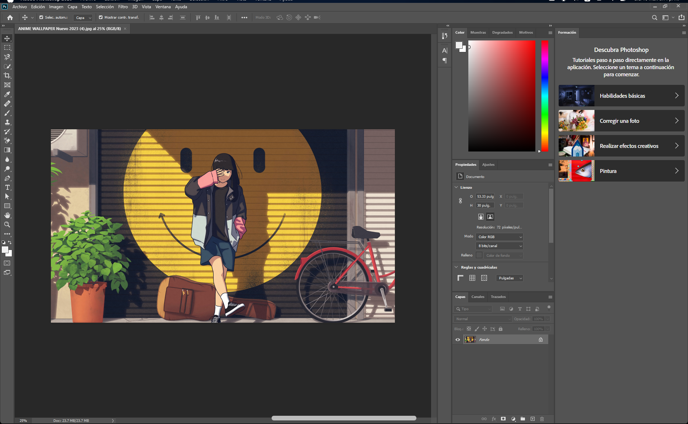
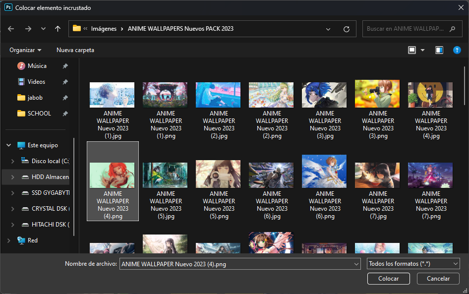
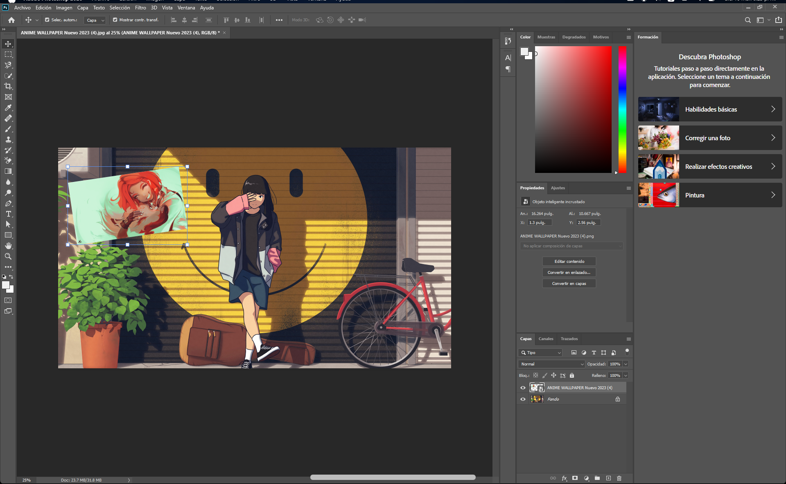
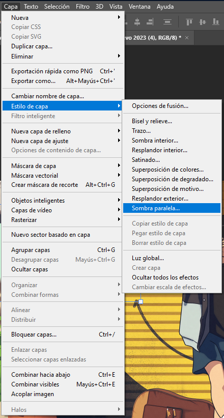
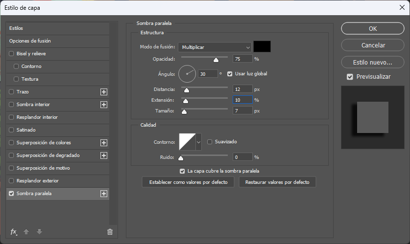
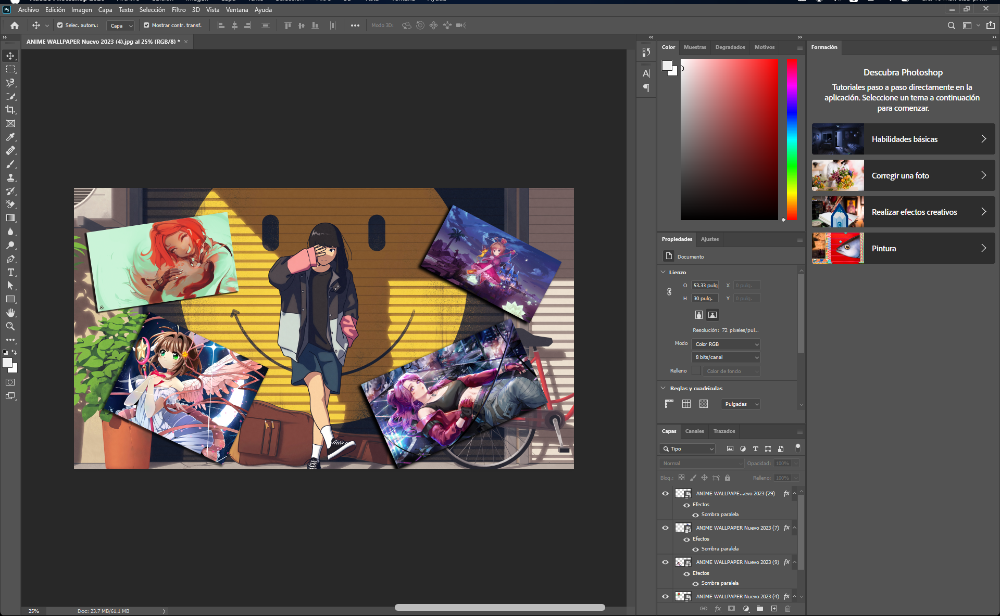

# Práctica: Creación de un Álbum Creativo en Photoshop

En esta práctica aprenderás a trabajar con múltiples imágenes en Photoshop, aplicando técnicas como la importación de imágenes, escalado, rotación y estilos de capa. Al final, crearás un álbum visual atractivo con varias imágenes personalizadas.

---

### Paso 1: Abrir una Imagen
1. Inicia Photoshop.
2. Ve al menú **Archivo** y selecciona la opción **Abrir** o usa el atajo de teclado **Ctrl + O**.
3. En la ventana emergente, selecciona una imagen de tu agrado y haz clic en **Abrir**.
4. Verás la imagen en el lienzo de trabajo. Tu pantalla debe verse algo así:

   

---

### Paso 2: Colocar Otra Imagen
1. Ve nuevamente al menú **Archivo**, pero esta vez selecciona **Colocar**.

   

2. Escoge un archivo de tu agrado en la ventana emergente y haz clic en el botón **Colocar**.

   

3. La imagen aparecerá en el lienzo, adaptada al tamaño del lienzo.

---

### Paso 3: Escalar y Rotar la Imagen
1. Para escalar la imagen, selecciona una esquina y arrástrala hacia adentro para reducir su tamaño.

   

2. Una vez escalada, rota la imagen en la dirección que prefieras.
3. Cuando termines, presiona **Enter** para aplicar los cambios. Tu lienzo debe verse algo así:

   

---

### Paso 4: Añadir una Sombra Paralela
1. Ve al menú **Capa** > **Estilo de capa** > **Sombra paralela**.

   

2. En la ventana de configuración que aparece, ajusta los siguientes valores:
   - **Distancia**: 12px
   - **Extensión**: 10%
   - **Tamaño**: 7px

3. Aplica los cambios y observa el efecto en tu imagen.

---

### Paso 5: Repetir el Proceso con Varias Imágenes
1. Coloca más imágenes en el lienzo y repite los pasos anteriores para escalarlas, rotarlas y aplicarles sombras paralelas.
2. Para cambiar la dirección de la sombra, modifica el valor del **Ángulo** en la configuración de la sombra paralela.
3. Al final, tu proyecto debería lucir algo así:

   

### 💡 Nota: los valores son opcionales; puede ir observando los cambios que se realizan a su imagen y oprimir **OK** hasta que quede como a usted le agrade.  

---

### Paso 6: Guardar el Proyecto
1. Ve a **Archivo** > **Guardar como**.
2. Si planeas seguir editando el proyecto, guárdalo en formato **PSD** para conservar las capas.
3. Si ya terminaste, guárdalo como una imagen (¡elige el formato que prefieras, como PNG o JPG!). Nomábralo como “Álbum”.

---

¡Felicidades! Has completado la práctica y ahora sabes cómo trabajar con múltiples imágenes en Photoshop, aplicar efectos y crear composiciones personalizadas. Experimenta con diferentes imágenes y estilos para perfeccionar tus habilidades.

