# Práctica: Crear un Efecto de Collage en Photoshop

En esta práctica, aprenderás a crear un collage visual en Photoshop utilizando texturas, máscaras de recorte, formas, y efectos de capas. Sigue los pasos detallados y desarrolla tu creatividad para obtener un resultado único.

---

### Paso 1: Crear el Fondo
1. Abra Photoshop y cargue una textura o imagen para usar como fondo, como por ejemplo una textura de madera envejecida o una imagen de cielo con nubes suaves.

   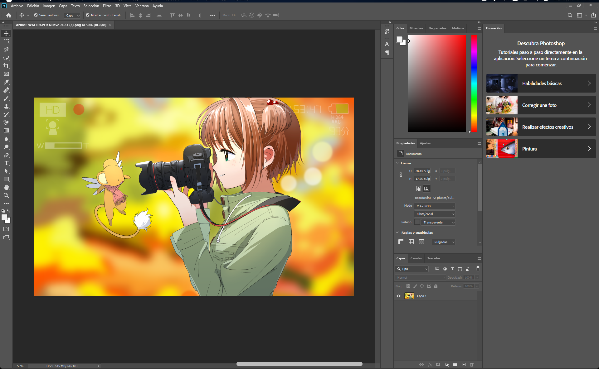

2. Cree una nueva capa y rellénela con una textura, imagen, degradado o color de tu preferencia.

   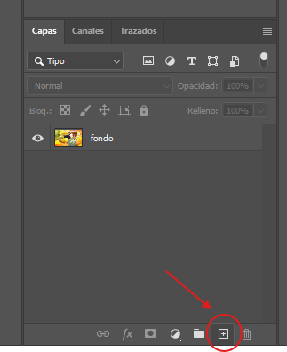

   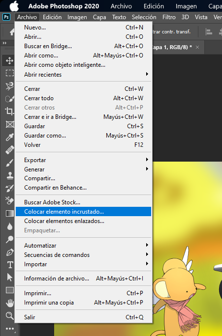

   

3. Duplique la capa de fondo y colóquela sobre la textura o imagen para que esta quede entre las dos capas de fondo.

   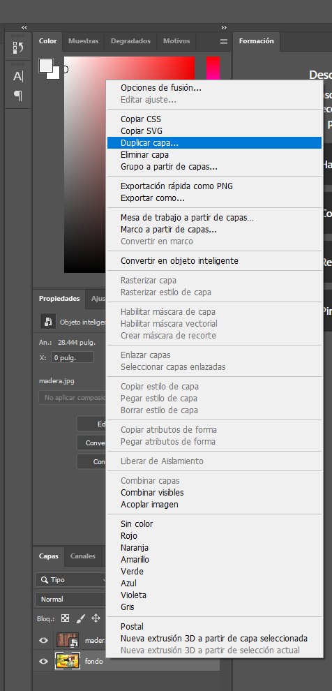

   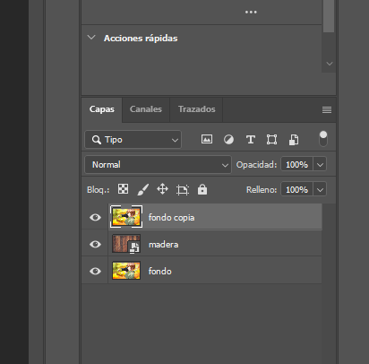

---

### Paso 2: Crear el Marco Fotográfico
1. Cree una nueva capa entre la copia de fondo y la textura.

2. Utilizando la herramienta Rectángulo (tecla **U**), dibuje un rectángulo en la nueva capa. Puede ajustar el tamaño o las proporciones del rectángulo arrastrando los puntos de ancla o modificando los valores en las propiedades de la herramienta para que coincida con el diseño deseado.

   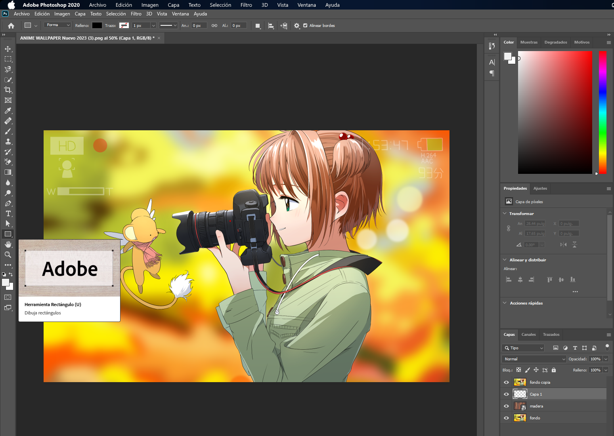

   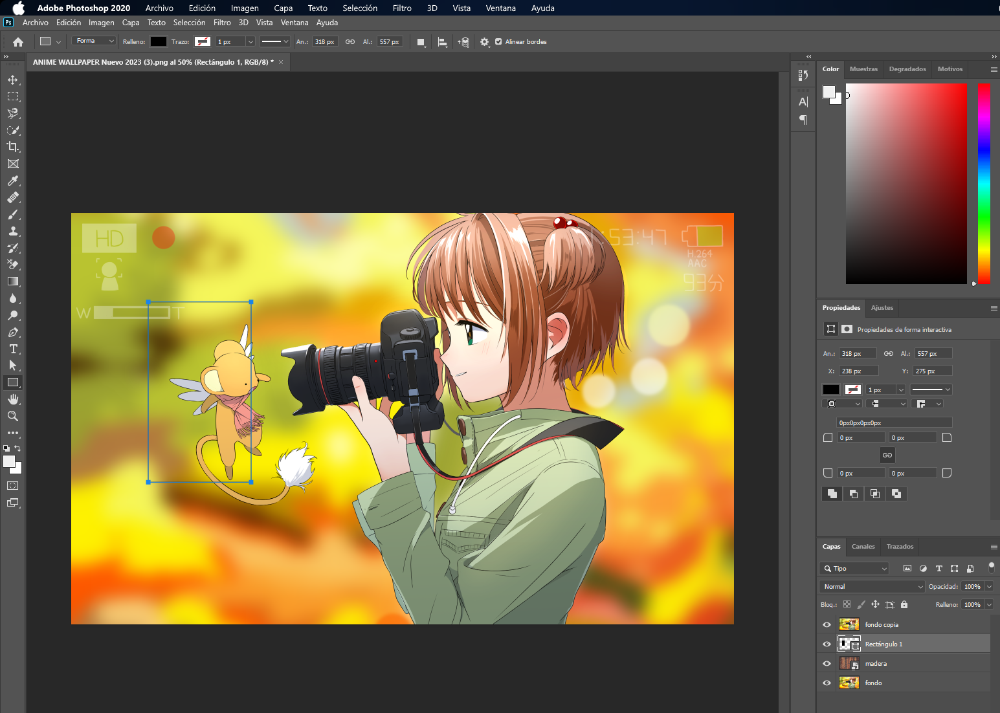

  

3. Convierta la copia de fondo en una máscara de recorte:

Este proceso permite que la imagen o textura de fondo se ajuste visualmente a la forma del rectángulo, creando un efecto de integración entre las capas que destaca la textura dentro de un marco definido.
   - Haga clic derecho sobre el nombre de la capa y seleccione **Crear máscara de recorte**.

   

---

### Paso 3: Ajustar la Forma del Marco
1. Vaya a la pestaña de **Trazados** y seleccione **Máscara vectorial Forma Rectángulo 1**. Haga clic derecho y elija **Hacer selección**.

   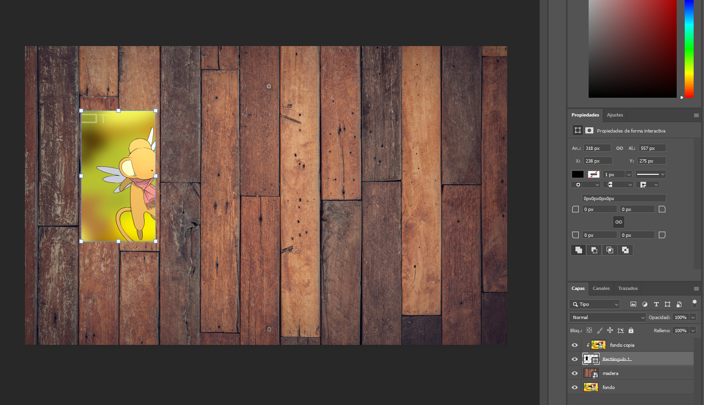

   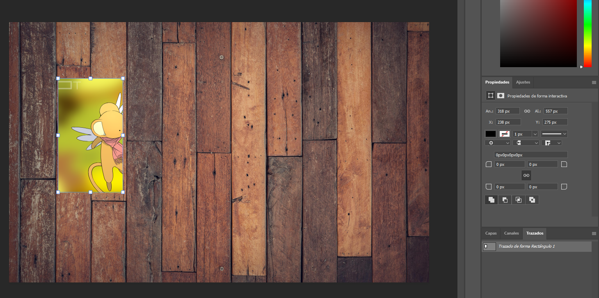

   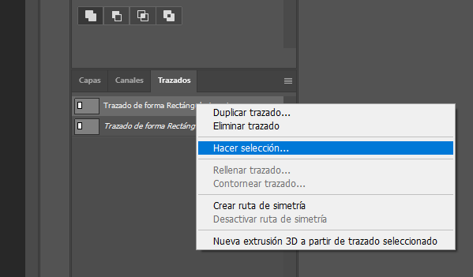

2. Ajuste los parámetros como se indica en la siguiente ventana:

   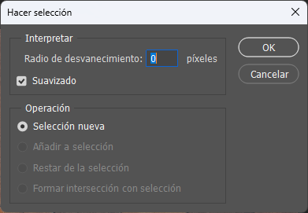

3. Vaya al menú **Selección** > **Transformar selección** y modifique el tamaño para ajustarlo según sea necesario.

   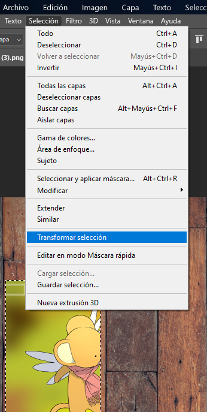

4. Cree una nueva capa debajo de la capa Rectángulo 1 y rellene la selección utilizando el menú **Edición** > **Rellenar** (teclas **Mayús + F5**).

   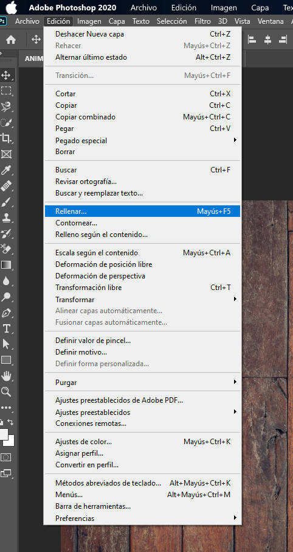

   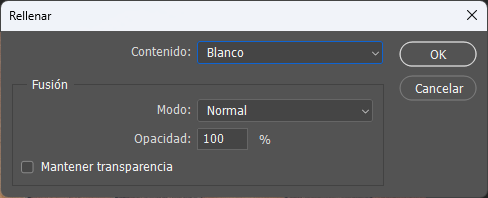

---

### Paso 4: Modificar la Posición del Marco
1. Enlace las capas **Rectángulo 1** y **Capa 1**:
   - Mantén presionada la tecla **Mayús** mientras seleccionas ambas capas y haz clic en el ícono de cadena.

   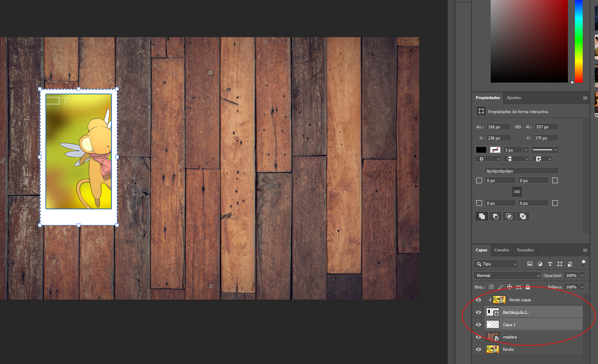

   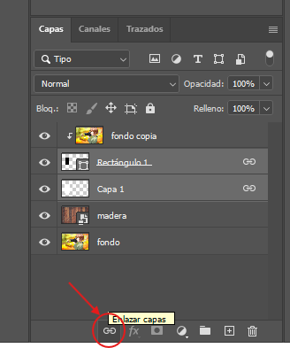

2. Usa la opción de **Transformación libre** (teclas **Ctrl + T**) para acomodar el marco según tu preferencia.

   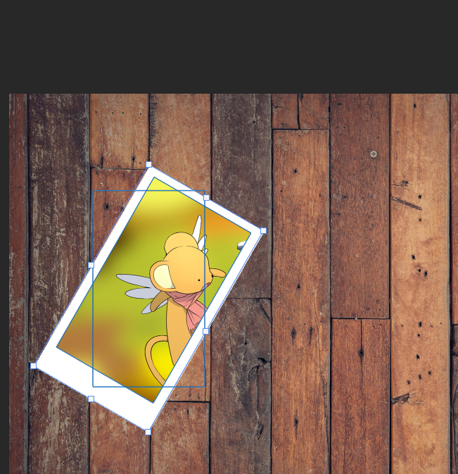

---

### Paso 5: Agregar Efectos
1. Aplica una **Sombra paralela** a la Capa 1:

   - Haz doble clic sobre la capa para abrir las Opciones de fusión y ajusta los parámetros de sombra.

   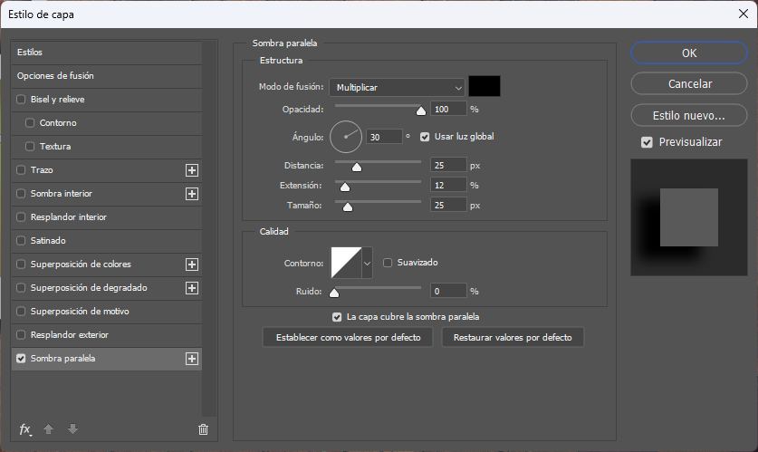

2. Si lo deseas, agrega un trazado para darle más profundidad al marco.

3. Agrupa las capas **Fondo copia**, **Rectángulo 1** y **Capa 1**:
   - Selecciona las capas y usa la opción **Nuevo grupo a partir de capas**.

   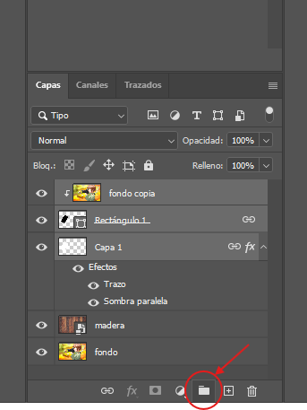

   - Asigna un nombre al grupo, como “Fotografía”.

   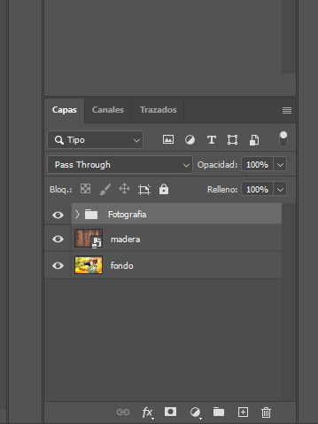

---

### Paso 6: Crear Variaciones del Collage
1. Duplica el grupo tantas veces como desees para crear el efecto de collage. Por ejemplo, para un lienzo de tamaño estándar (1920x1080 píxeles), puedes duplicar entre 4 y 8 veces para lograr un diseño equilibrado y visualmente atractivo.
2. Ajusta las posiciones y tamaños con la herramienta **Transformación libre** (Ctrl + T).
3. Experimenta con diferentes efectos, texturas y colores para personalizar cada marco.

   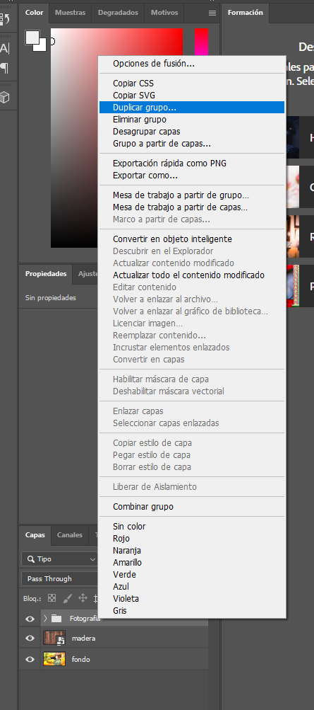

4. El resultado final será un collage creativo como este:

   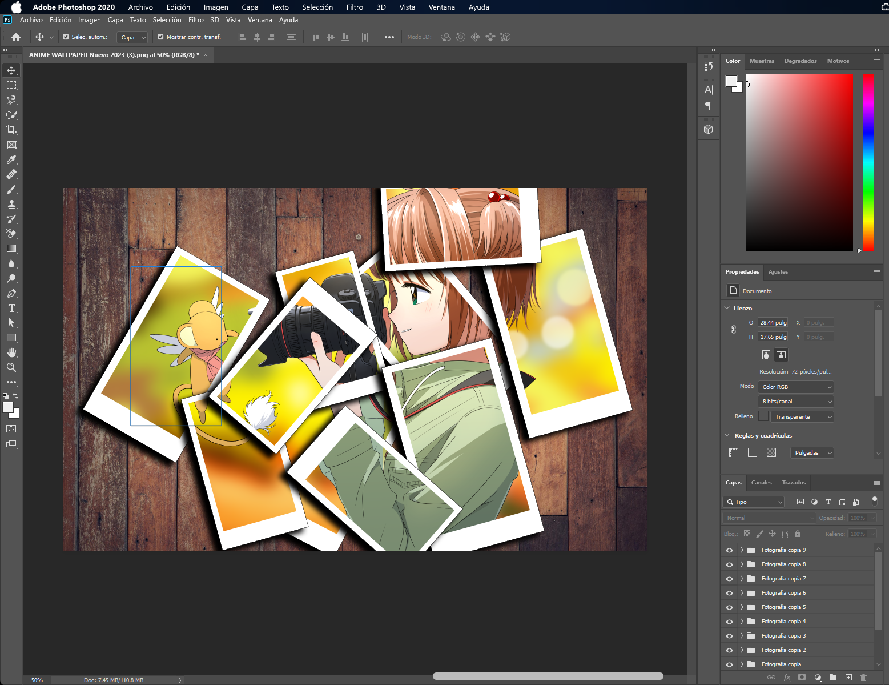

---

¡Explora tu creatividad y diviértete creando tu propio collage en Photoshop!

