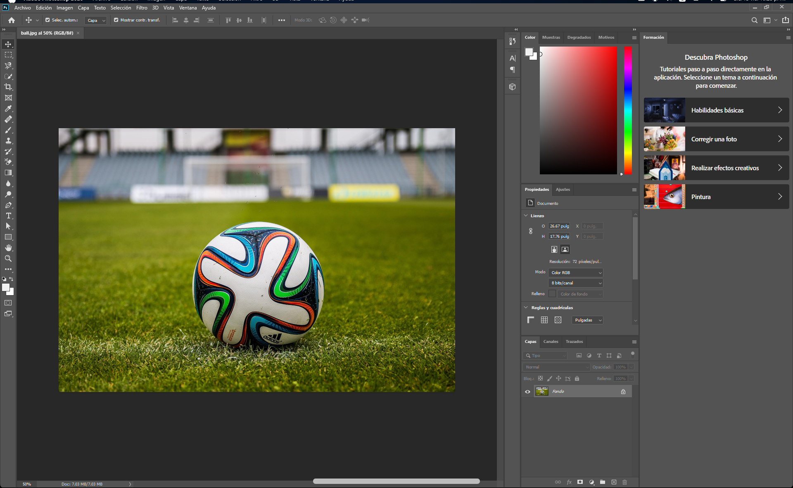
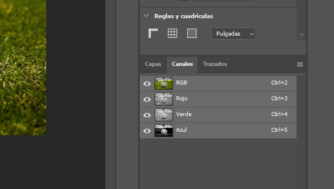
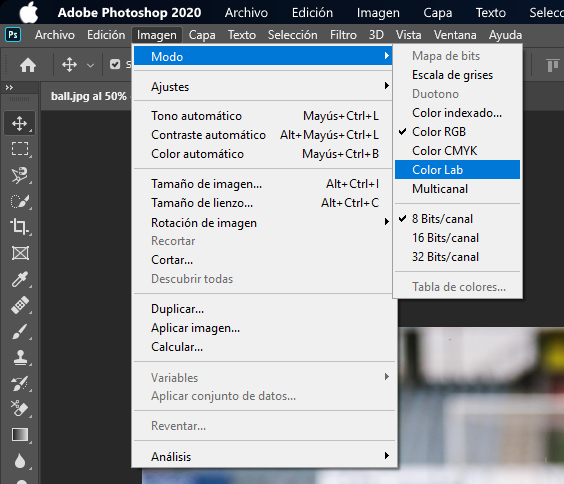
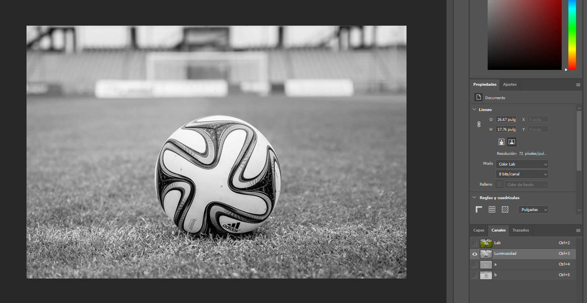
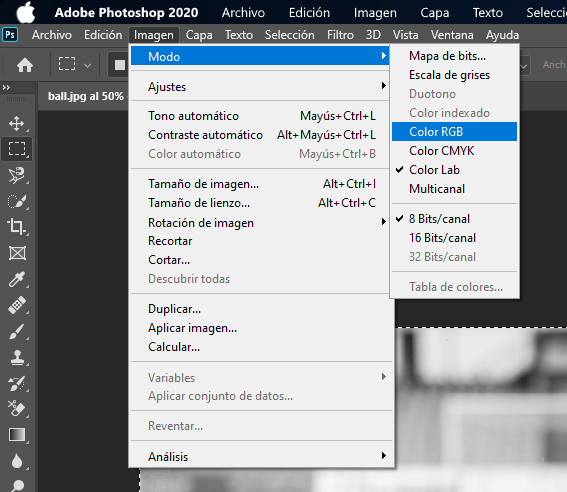
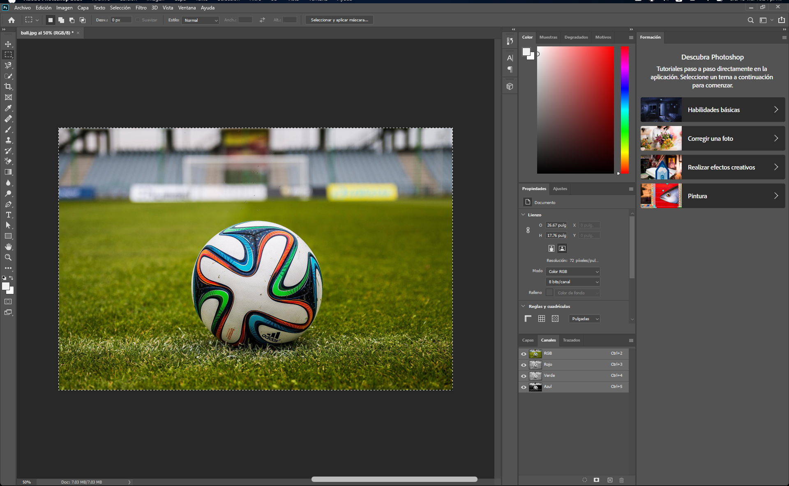
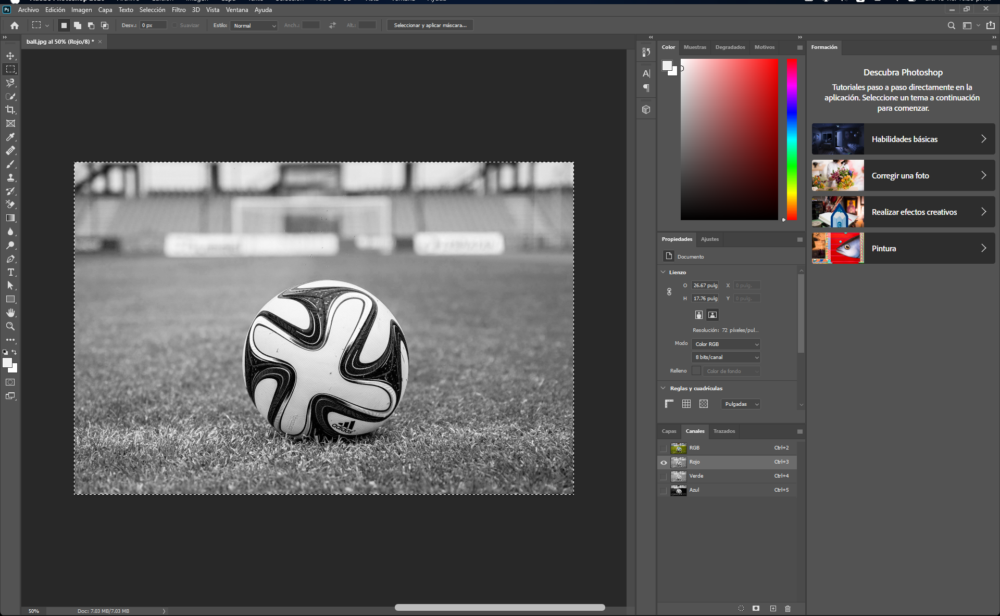
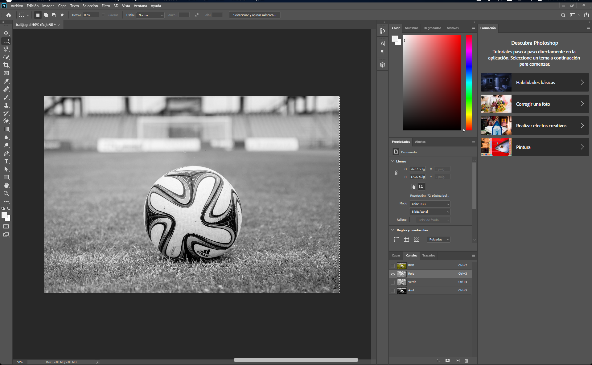
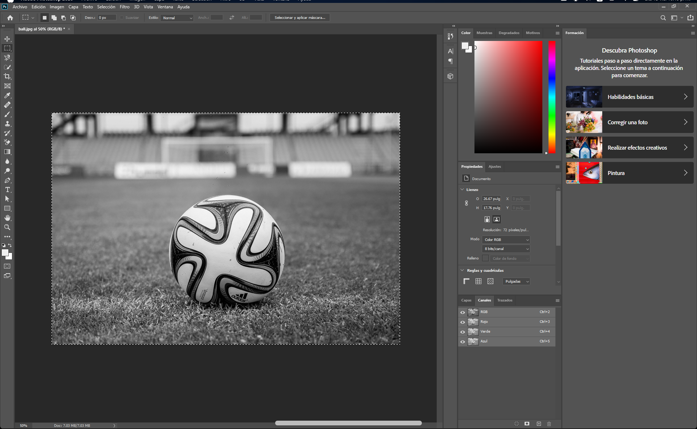

### **Convertir una Imagen a Blanco y Negro con Calidad Usando Colores Lab** 🎨🖤  

En esta práctica, aprenderás a transformar una fotografía a color en una imagen de blanco y negro de alta calidad utilizando el modo de color **Lab** en Photoshop. Este método es sencillo y profesional, perfecto para mejorar el contraste y la nitidez de tus imágenes monocromáticas.  

---

#### **Paso 1: Selecciona y guarda tu imagen original** 📸  

- Elige una fotografía a color que te guste.  
- Guarda la imagen con el nombre **"Antes"** para poder comparar los resultados más tarde.  

---

#### **Paso 2: Abre tu imagen en Photoshop** 🖥️  

- Utiliza el menú **Archivo > Abrir**, o presiona la combinación de teclas **Ctrl + O** para abrir tu imagen.  
- Para este ejemplo, usaremos la imagen de un balón.  

---

#### **Paso 3: Habilita el panel de capas y selecciona canales** 🗂️  

- Activa el panel de capas con la tecla **F7**.  
- Haz clic en la pestaña **Canales** dentro del mismo panel. Verás que aparecen los canales RGB: Rojo, Verde y Azul.  

---

#### **Paso 4: Cambia el modo de color a Lab** 🌈  

- Ve a **Menú Imagen > Modo > Color Lab**.  
- Notarás que los canales RGB ahora cambian a **Luminosidad**, **a**, y **b**.  

  
  

---

#### **Paso 5: Selecciona el canal de Luminosidad** 🖤  

- Haz clic en el canal **Luminosidad**. La imagen cambiará automáticamente a blanco y negro, utilizando los datos de luz y sombra originales.  

---

#### **Paso 6: Selecciona y copia la imagen en blanco y negro** 📋  

- Selecciona toda la imagen con **Ctrl + A** (o usa la herramienta Marco rectangular).  
- Copia la imagen seleccionada con **Ctrl + C** o desde **Edición > Copiar**.  

  

---

#### **Paso 7: Vuelve al modo de color RGB** 🌈  

- Cambia nuevamente al modo **RGB**: ve a **Menú Imagen > Modo > Color RGB**.  
- La imagen volverá a color y los canales se restaurarán al modo RGB.  

  
  

---

#### **Paso 8: Pega la imagen en los canales RGB** ✂️  

- Ve a los canales individualmente (**Rojo, Verde, Azul**) y pega la imagen en blanco y negro en cada uno:  
  - Selecciona el canal **Rojo** (**Ctrl + 3**) y pega con **Ctrl + V**.  
  - Repite el proceso para los canales **Verde** (**Ctrl + 4**) y **Azul** (**Ctrl + 5**).  

#### **Resultado: Antes y después de pegar en los canales**  

- **Antes:** Menor nitidez y calidad.  
  

- **Después:** Mayor luminosidad y nitidez.  
  

---

#### **Paso 9: Visualiza los canales en blanco y negro** 🖤  

- Después de pegar la imagen en los tres canales, verifica que cada uno se vea en blanco y negro en el panel de canales.  

---

#### **Paso 10: Resultado final** ✅  

- La imagen debería lucir nítida y contrastada en blanco y negro.  
  

---

#### **Paso 11: Guarda tu imagen procesada** 💾  

- Guarda el archivo con el nombre **"Después"**. Ahora tienes una versión en blanco y negro de alta calidad que puedes usar para cualquier proyecto creativo.  

¡Felicidades! Has aprendido a transformar imágenes en blanco y negro utilizando el método Lab, una técnica que eleva la calidad de tus fotografías monocromáticas. 🎉  

---  
**Comparte tu resultado y sigue practicando con nuevas herramientas en Photoshop para dominar el arte del diseño digital.** ✨  