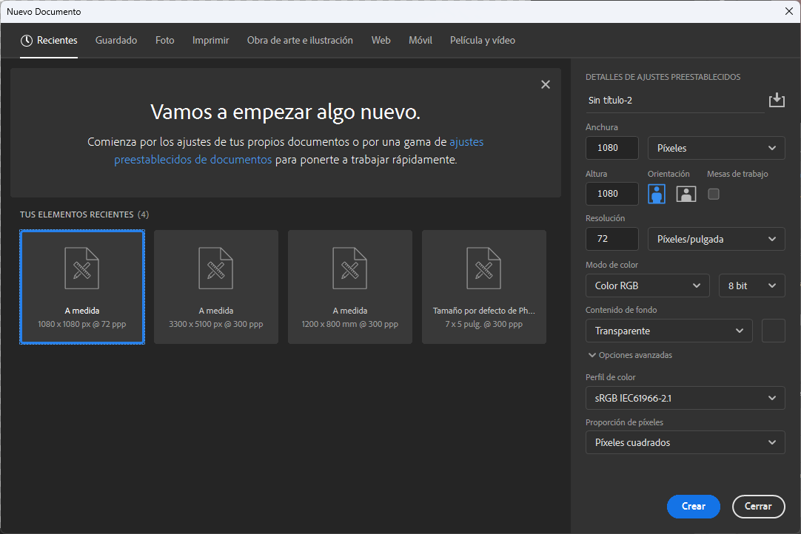
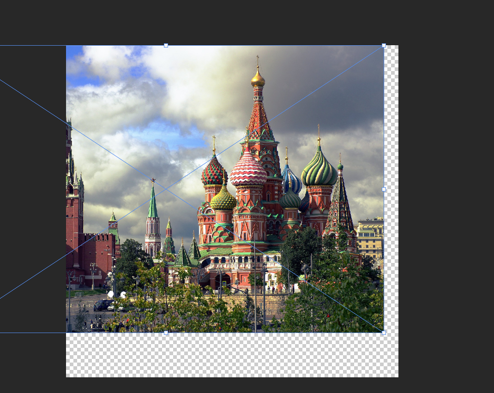

# Portada de instagram

En esta guía paso a paso, aprenderás a crear una composición visual en Photoshop con una imagen de fondo, efectos de relleno y texto estilizado.

---

### Paso 1: Crear un Nuevo Archivo
1. Abre Photoshop y crea un nuevo archivo con las siguientes especificaciones:
   - **Tamaño**: 1080x1080 px
   - **Resolución**: 72 dpi
   - **Modo de color**: RGB

   

---

### Paso 2: Insertar una Imagen de Fondo
1. Coloca una imagen de paisaje o ciudad de alta calidad en el documento.
   - Puedes buscar imágenes gratuitas en sitios como [Pixabay](https://pixabay.com/).

   

---

### Paso 3: Aplicar una Máscara de Relleno Blanco y Negro
1. Ve al menú **Capa** > **Nueva capa de ajuste** > **Blanco y negro**.
2. Selecciona la opción "Blanco y Negro" en los ajustes de la máscara de relleno.

   
   

---

### Paso 4: Ajustar los Niveles
1. Abre los ajustes de niveles (**Ctrl + L**) para mejorar la tonalidad de la imagen.
2. Ajusta los deslizadores para obtener el contraste deseado.

   

---

### Paso 5: Crear un Rectángulo Centrado
1. Selecciona la herramienta **Rectángulo** (tecla **U**).
2. Dibuja un rectángulo en el lienzo mientras mantienes presionadas las teclas **Alt** y **Shift** para centrarlo y mantener las proporciones.

   
   

---

### Paso 6: Cambiar el Relleno del Rectángulo a Degradado
1. En las propiedades del rectángulo, selecciona **Relleno** > **Degradado**.
2. Configura los colores del degradado:
   - Elige el mismo color para ambos extremos.
   - Ajusta la opacidad del extremo derecho a **0%**.

   
   
   
   

---

### Paso 7: Agregar Sombra Paralela
1. Haz doble clic en la capa del rectángulo o ve al menú **Capa** > **Estilos de capa** > **Sombra paralela**.
2. Configura los parámetros de la sombra para crear un efecto sutil y elegante.

   
   

---

### Paso 8: Agregar Texto
1. Selecciona la herramienta **Texto** (tecla **T**).
2. Escribe el texto deseado y ajústalo dentro del rectángulo.
3. Duplica la capa de texto para agregar una segunda línea con diferente contenido.

   
   

---

### Resultado Final
El resultado será una composición profesional con una imagen estilizada, un rectángulo degradado y texto atractivo.

   

---

¡Explora tu creatividad y personaliza tu diseño con diferentes colores, sombras y textos!

