1. Abra la imagen de "Rinoceronte"
2. Realice una seleccion con la herramienta lazo poligonal

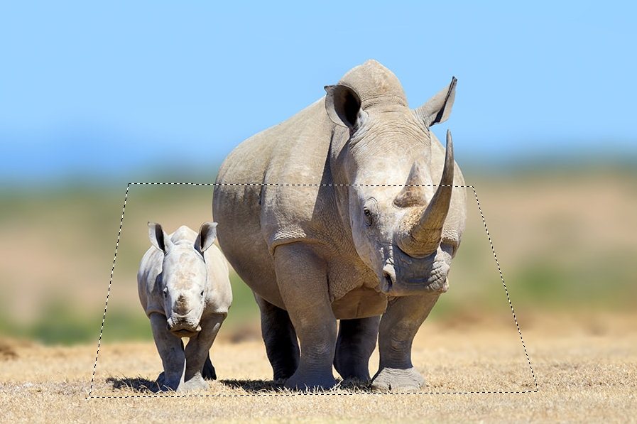

3. Guarda la seleccion conn el nombre "Marco", en el menú selección, opción ***Guardar selección***

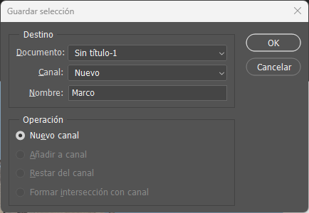

4. Con la herramienta **Pluma** traza el contorno de las partes que quedan fuera del marco que creaste.

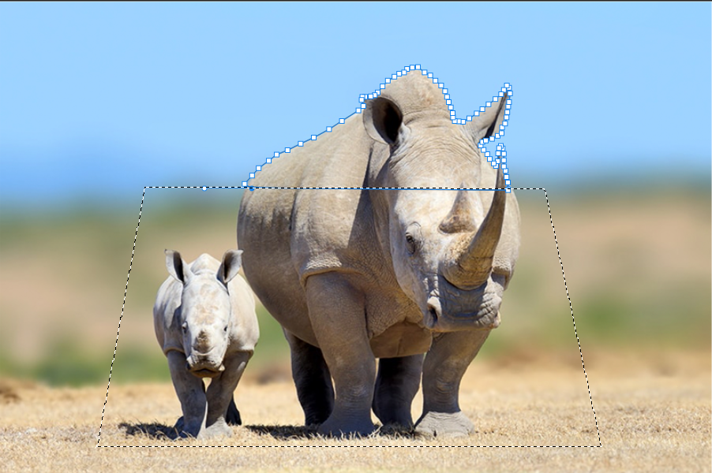

5. Una vez trazados, vaya al panel de **Trazados** y haga *clic* con el botón derecho del mouse sobre el trazado, y luego haga *clic* en la opción **Hacer selección** para transformarel trazado en selección. En la ventana que aparece, modifique el valor de **Radio de desvanecer** a 3.

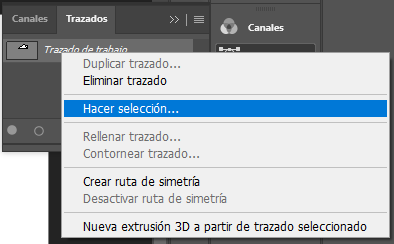
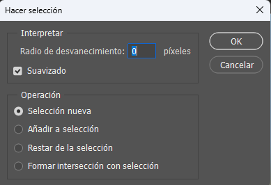

6. Presione <Ctrl + J> para duplicar la selección a una nueva capa.

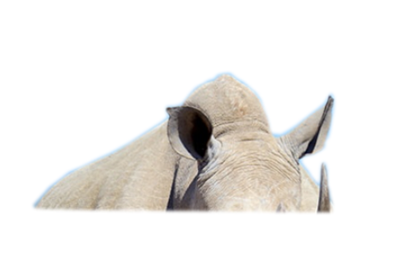

7. Haga doble *clic* sobre la capade fondo para copnvertir a capa. Con la **Capa 0** seleccionada, vaya al menú Selección, opción **Cargar selección**, elija en **Canal** la opción **Marco**.

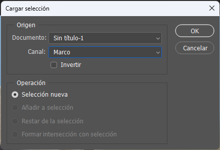

8 Con la selección cargada, inviertala presionando <Ctrl + Mayús + I>, quedará así.

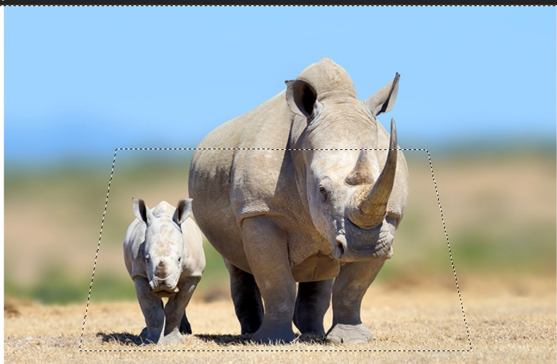

9. Presione \<Supr> para eliminar el área sobrante del marco.

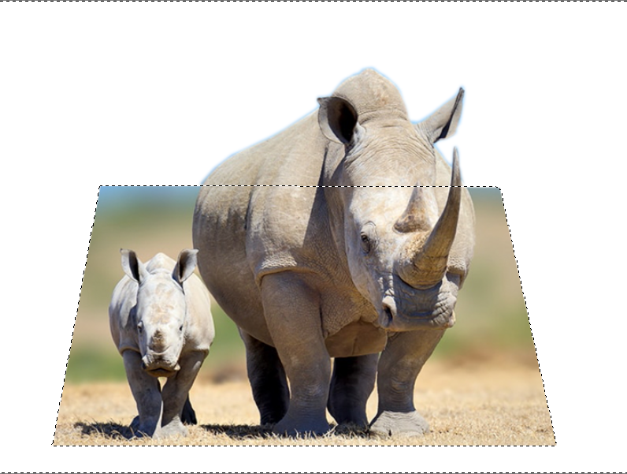

10. Vuelva a invertir la selección, para que seleccione nuevamente el marco. haga *clic* en el menú **Selección**, submenú **Modificar**, opción **Contraer** y modifique el valor a 15.

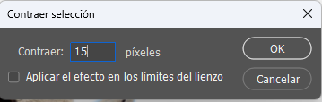

11. Se creará una selección de la misma forma pero más pequeña, lo cual formará el marco de la foto. Presione <Ctrl + J> para duplicar la selección.

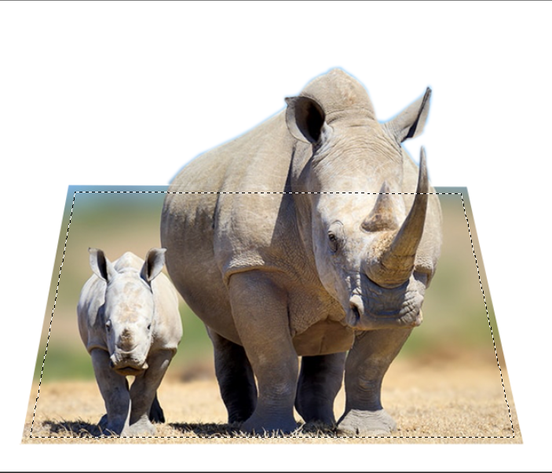

12. Seleccione la **Capa 0** y presione <Mayús + F5> para **Rellenar**; elija la opción **Color** y haga *clic* sobre el color gris claro.

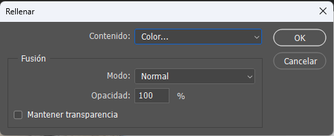
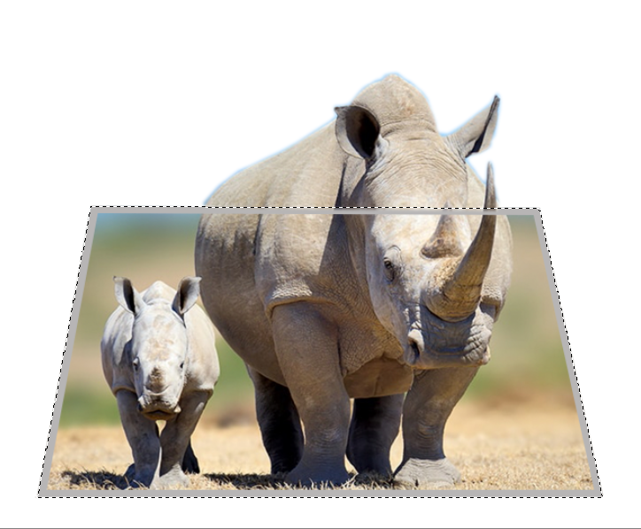

13. Haga doble *clic* sobre la **Capa 0** en el panel de **Capas**, para agregar una sombra paralela; coloque una **Opacidad** de 77, **Modo de fusión**: multiplicar, **Distancia**: 21, **Extensión**: 31, **Tamaño**: 5 y **Ángulo**: 30.

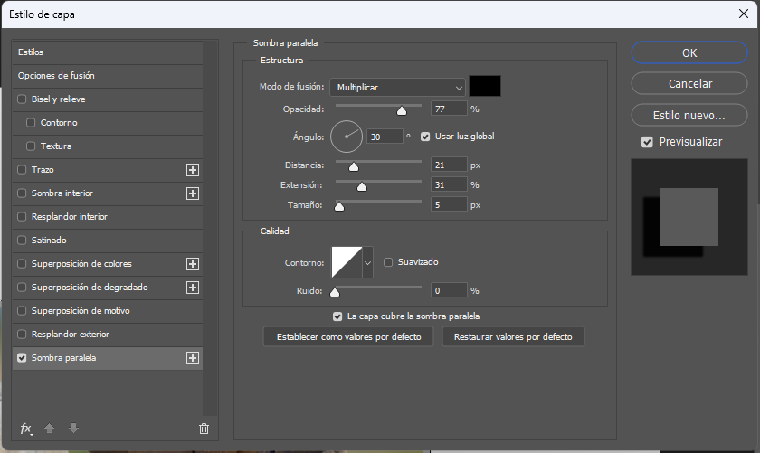

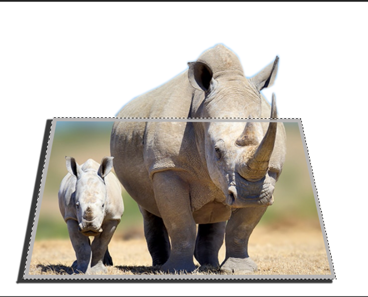

14. Cree una nueva capa <Ctrl + Mayús + N> y nómbrela "Fondo", enviela al fondo de las capas. Coloque un degradado de los colores que mas le guste.

