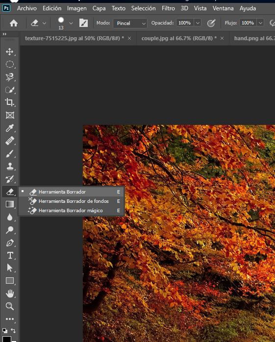

### Creando una Composición Artística en Photoshop: Integración de Imágenes y Estilos  

En esta practica, aprenderás a combinar diferentes imágenes en Photoshop para crear una composición visual única. Este ejercicio te ayudará a practicar habilidades como la selección precisa, el uso de herramientas de borrado, la aplicación de estilos de capa y la integración de elementos en un diseño coherente. A continuación, te presentamos los pasos detallados para esta práctica creativa.  

---

#### Paso 1: Abre las imágenes base  
Para empezar, necesitas tres imágenes: **"Paisaje"**, **"Pareja"**, y **"Mano"**. Estas serán los elementos principales de tu composición.  

  

---

#### Paso 2: Selecciona y combina elementos  
1. Usa la herramienta **Marco elíptico** para seleccionar la pareja en la imagen correspondiente.  
2. Copia la selección con \<Ctrl + C> y pégala en la imagen "Paisaje" con \<Ctrl + V>.  

  

---

#### Paso 3: Suaviza los bordes con el Borrador  
1. Selecciona la herramienta **Borrador**.  
   - Tamaño: 100  
   - Tipo: Círculo difuso  
2. Borra los bordes de la imagen de la pareja para integrarla suavemente en el paisaje.  

  

  

---

#### Paso 4: Añade un Resplandor Exterior  
1. Haz doble clic en la capa donde se encuentra la pareja para abrir los **Estilos de capa**.  
2. Aplica un **Resplandor exterior** con las siguientes propiedades:  
   - Opacidad: 83%  
   - Ruido: 3  
   - Color: #cedcdd  
   - Extender: 11  
   - Tamaño: 106  
   - Rango: 56  
   - Vibración: 0  

  

  

---

#### Paso 5: Añade la imagen de la Mano  
1. Selecciona la herramienta **Lazo poligonal** para contornear la imagen de la "Mano".  
2. Copia la selección y pégala debajo de la pareja en la composición.  

  

  

---

#### Resultado Final: Una Composición Integrada  
Después de seguir todos los pasos, obtendrás una composición en la que las imágenes se combinan armoniosamente, con efectos de luz y bordes suaves que resaltan cada elemento.  

  

---

Este ejercicio no solo te ayudará a mejorar tus habilidades técnicas en Photoshop, sino que también te permitirá explorar la creatividad al combinar imágenes y aplicar efectos. ¡Intenta personalizar los ajustes y añade tu toque único a la composición! 🌟  