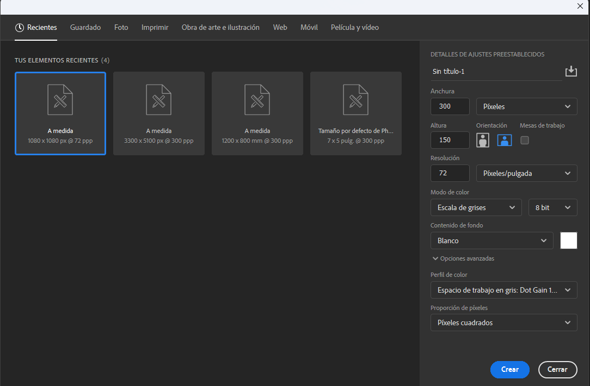
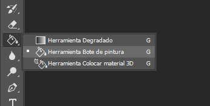
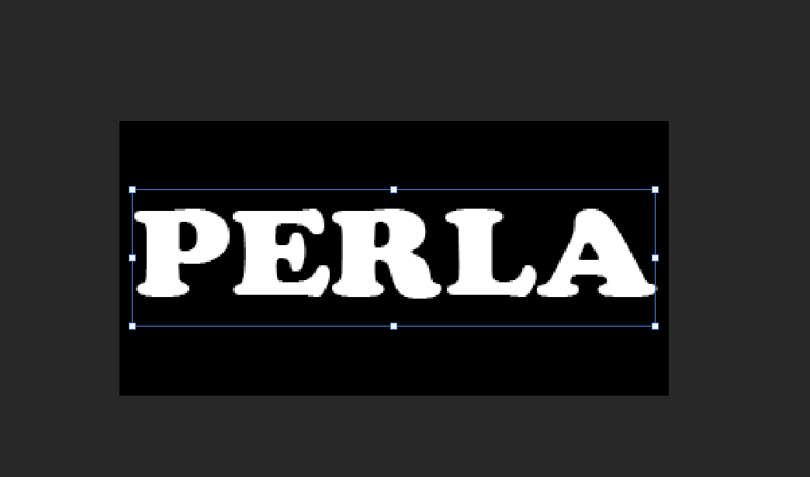
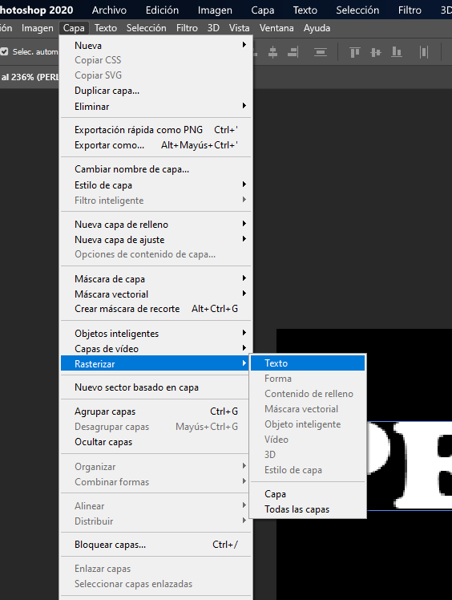

# Texto de fuego

En esta práctica aprenderás a crear un efecto en un texto trabajando en el modo de color **escala de grises**.  

### 1. Crea un nuevo lienzo de 300 x 150 píxeles con color de fondo blanco y modo de color **escala de grises**.  

  

**NOTA:** Es importante cerciorarse de que el modo de color está en **escala de grises**, ya que de lo contrario la práctica no funcionará.  

### 2. Selecciona la herramienta de bote de pintura y, con el color frontal negro, haz clic sobre el lienzo para que el fondo se vea como en la imagen.  

  
  

### 3. Ahora selecciona la herramienta de texto. Usa el color blanco y un tamaño de letra grande para escribir tu nombre. (Tipo de letra: **Cooper Black**, tamaño: **80 pts**).  

  

### 4. El panel de capas se visualiza de la siguiente manera:  

  

Selecciona el menú **Capa**, opción **Rasterizar**, y elige **Texto**, como se muestra en la imagen:  

  

No notarás ningún cambio en la imagen, pero ahora el panel de capas debe verse así:  

  

Esto ocurre porque la capa de texto se ha convertido en una capa de imagen.  

### 5. Ve al menú **Capa** nuevamente y selecciona la opción **Acoplar imagen**, como se muestra a continuación:  

  

De nuevo, no notarás ningún cambio en la imagen, pero el panel de capas ahora debe verse así:  

  

### 6. Ve al menú **Imagen**, opción **Rotación de imagen**, y selecciona **90° ACD**.  

  

Después, la imagen se verá de esta manera:  

  

### 7. Una vez que realices este paso, haz clic en el menú **Imagen**, opción **Ajustes**, y selecciona **Invertir imagen**.  

  

La imagen debe verse de la siguiente forma:  

  

### 8. Haz clic en el menú **Filtro**, opción **Estilizar**, y selecciona **Viento**.  

  

Aparecerá la siguiente ventana:  

  

En ella, elige la opción **Desde la derecha** y haz clic en **OK**. La imagen se verá así:  

  

### 9. Ve al menú **Imagen**, opción **Ajustes**, y selecciona **Invertir imagen** nuevamente. La imagen ahora se verá así:  

  

### 10. Aplica dos veces más el efecto viento usando la combinación de teclas **Ctrl + Alt + F**. Ahora el lienzo debe verse así:  

  
  

### 11. Rota la imagen a su posición original. Para ello, ve al menú **Imagen**, opción **Rotación de imagen**, y selecciona **90° AC**.  

  

La imagen se verá de esta forma:  

  

### 12. A continuación, ve al menú **Filtro**, opción **Distorsionar**, y selecciona **Rizo**.  

  

Asigna un valor de **100** (el valor es opcional, puedes probar diferentes valores hasta lograr el resultado deseado).  

  

La imagen se verá así:  

  

### 13. Cambia el modo de la imagen en el menú **Imagen**, opción **Modo**, selecciona **Color indexado**, como se muestra en la imagen:  

  

Notarás solo un cambio muy leve en la imagen.  

### 14. Ve al menú **Imagen**, opción **Modo**, y selecciona **Tabla de colores**.  

  

Aparecerá la siguiente ventana:  

  

### 15. En la sección **Tabla** de la ventana, elige la opción **Cuerpo negro**. La tabla se mostrará así:  

  

### 16. Haz clic en **OK**, y listo. La imagen se verá de la siguiente manera:  

  

### 17. Guárdala con el nombre **Texto de fuego**.  

---  