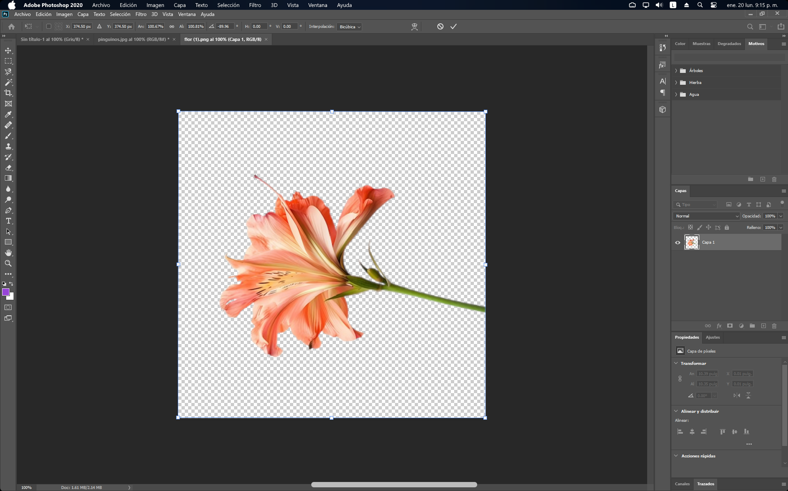

### Creando un Reflejo Realista en Photoshop: Paso a Paso  

En este blog, aprenderás a crear un reflejo realista de un objeto sobre una superficie plana utilizando Photoshop. Este ejercicio te ayudará a dominar herramientas como duplicar capas, transformar imágenes, aplicar máscaras y trabajar con degradados para lograr efectos visuales impresionantes.  

---

#### Paso 1: Abre la imagen principal  
Comienza abriendo la imagen llamada **"Flor"** desde el menú **Archivo** y seleccionando la opción **Abrir**.  

  

---

#### Paso 2: Duplica la capa  
1. Ve al menú **Capas** y selecciona **Duplicar capa**. Esto generará una copia de la capa principal.  
2. Al duplicar la capa, el panel **Capas** debería verse así:  

  
  

---

#### Paso 3: Renombra y voltea la capa duplicada  
1. Cambia el nombre de la capa duplicada a **"Reflejo"**.  
2. Selecciona la capa "Reflejo" y ve al menú **Edición** > **Transformar** > **Voltear verticalmente**.  

  
Resultado:  

  

---

#### Paso 4: Ajusta las capas  
1. Mueve la capa "Reflejo" hacia abajo y alinea ambas capas para que queden como se muestra:  

  

---

#### Paso 5: Aplica una máscara para simular el reflejo  
1. Selecciona la capa "Reflejo" y activa el **Modo editar máscara** haciendo clic en el botón correspondiente.  

  

2. Usa la herramienta **Degradado** para trazar una línea de arriba hacia abajo, comenzando un poco por encima de la capa "Reflejo" y terminando un 15% antes de que termine la capa principal.  

  

3. Regresa al **Modo estándar** haciendo clic en el botón **Editar en modo estándar**. Esto creará una selección degradada.  

  

4. Presiona la tecla **Supr** o **Delete** para eliminar la parte degradada, logrando este resultado:  

  

---

#### Paso 6: Ajusta el relleno de la capa "Reflejo"  
1. Reduce el **Relleno** de la capa "Reflejo" al 70% para suavizar el efecto del reflejo.  

  

---

#### Paso 7: Crea una capa para la superficie  
1. Crea una nueva capa llamada **"Mesa"** y colócala debajo de todas las capas existentes.  
2. Inserta la imagen de una mesa de vidrio y ajusta su tamaño al del documento.  

  
  

---

#### Paso 8: Enlaza las capas  
1. Selecciona las capas **"Flor"** y **"Reflejo"**.  
2. En el panel **Capas**, haz clic en el botón **Enlazar capas** para que cualquier transformación afecte ambas capas al mismo tiempo.  

  

---

#### Paso 9: Ajusta y transforma el objeto  
1. Usa la combinación de teclas \<Ctrl + T> para transformar el objeto hasta que quede algo similar a la composición final.  

  

---

### Resultado Final  
Siguiendo estos pasos, obtendrás una imagen con un reflejo realista sobre una superficie plana. Este ejercicio te permitirá explorar las capacidades creativas de Photoshop mientras perfeccionas técnicas avanzadas de edición. ¡Intenta aplicarlo a otros objetos para experimentar con diferentes resultados! 🌟  