# Adobe Photoshop

## La herramienta que transforma ideas en arte 🎨

Cuando hablamos de edición de imágenes y creación de gráficos, es inevitable pensar en **Adobe Photoshop**, la herramienta que ha revolucionado la manera en que interactuamos con el diseño digital. Con más de tres décadas en el mercado, Photoshop ha logrado posicionarse como el estándar en la industria, atrayendo tanto a principiantes curiosos como a profesionales exigentes. Pero, ¿qué hace que este software sea tan especial? ¡Acompáñanos a descubrirlo!

### El corazón del diseño gráfico moderno ❤️

Photoshop nació en 1988 como una sencilla herramienta de manipulación de imágenes, pero su evolución ha sido impresionante. Hoy en día, no solo se utiliza para retocar fotografías, sino que también es una plataforma integral para la creación artística, diseño web, ilustración, animación, y hasta modelado 3D. Desde la manipulación de color más básica hasta composiciones surrealistas que desafían la realidad, **Photoshop te da el control total sobre cada píxel de tu imagen.**

### Innovación constante 💡

Uno de los secretos detrás del éxito de Photoshop es su **capacidad para adaptarse y evolucionar**. Con cada nueva versión, Adobe agrega herramientas que parecen sacadas de un sueño futurista. Por ejemplo:

- **Relleno según contenido:** Una función que elimina objetos no deseados como si nunca hubieran existido. 
- **Filtros neuronales:** Herramientas basadas en inteligencia artificial que transforman imágenes de manera automática, como cambiar expresiones faciales o simular cambios de iluminación.
- **Animación y video:** Aunque tradicionalmente se asocia con imágenes fijas, Photoshop ahora permite trabajar con secuencias de cuadros y clips de video, abriendo un abanico de posibilidades creativas para animadores.

### El hogar de los artistas digitales 🏡

Photoshop es solo una pieza del enorme ecosistema de Adobe. Herramientas como Illustrator, After Effects y Lightroom complementan perfectamente sus capacidades, convirtiendo a la suite de Adobe en un paraíso para creadores. Además, su compatibilidad con múltiples formatos asegura que tus proyectos puedan ser utilizados en otras plataformas.

### ¿Alternativas? Claro, pero… 👀

Aunque Adobe Photoshop domina el mercado, existen alternativas interesantes para quienes buscan opciones más económicas o con enfoques diferentes. Aquí tienes algunas:

- **Affinity Photo:** Una herramienta potente y con un precio único (sin suscripción). Ideal para profesionales y aficionados avanzados. [Conócela aquí](https://affinity.serif.com/en-gb/photo/).
- **GIMP:** Software de código abierto completamente gratuito. Si bien no cuenta con la misma sofisticación de Photoshop, es una excelente opción para quienes buscan iniciarse. [Descárgalo aquí](https://www.gimp.org/).

Por supuesto, si quieres experimentar todo el poder y la versatilidad de Photoshop, puedes explorar su versión oficial en [Adobe](https://www.adobe.com/mx/products/photoshop.html).

### Más que un software, un medio de expresión ✨

Adobe Photoshop no es solo una herramienta; es un **lienzo infinito** para quienes desean plasmar ideas, romper barreras y explorar su creatividad. Desde editar una simple fotografía hasta crear obras maestras digitales, Photoshop ofrece posibilidades tan amplias como tu imaginación. 

Entonces, ¿estás listo para explorar el mundo de Photoshop y descubrir lo que puedes crear? **La magia del diseño digital está a solo un clic de distancia.** 

🎨 **¡Crea, transforma e inspírate!**

### Guia de instalacion de photoshop

##### Opción 1: Licencia Regular (Precio Completo)

1. **Compra una suscripción**  
   - Ve a la página oficial de Adobe: [Adobe Photoshop](https://www.adobe.com/mx/products/photoshop.html).
   - Crea una cuenta Adobe o inicia sesión.
   - Haz clic en “Comprar” o “Prueba gratuita”.
   - Elige el plan de “Aplicación individual” o el paquete “Creative Cloud” según tus necesidades.
   - Ingresa tus datos de pago y completa la compra.

2. **Descarga e instala Photoshop**  
   - Una vez realizada la compra, descarga el instalador desde tu cuenta Adobe.
   - Ejecuta el archivo descargado y sigue las instrucciones en pantalla.
   - Inicia sesión con tu cuenta Adobe para activar la licencia.

3. **Actualiza y comienza a usar Photoshop**  
   - Abre la aplicación Creative Cloud para verificar actualizaciones.
   - Inicia Photoshop y comienza a crear.

---

##### Opción 2: Licencia para Estudiantes y Profesores

1. **Verifica tu elegibilidad**  
   - Accede a la sección de [Descuentos para estudiantes y profesores](https://www.adobe.com/mx/creativecloud/buy/students.html).
   - Revisa los requisitos (correo institucional, comprobante de inscripción, etc.).

2. **Compra el plan educativo**  
   - Selecciona el plan “Creative Cloud para estudiantes y profesores” (incluye Photoshop y otras apps).
   - Haz clic en “Comprar ahora”.
   - Completa el proceso de verificación de estudiante/profesor.
   - Ingresa tus datos de pago y finaliza la compra (el precio es significativamente menor que el regular).

3. **Descarga e instala Photoshop**  
   - Descarga el instalador desde tu cuenta Adobe.
   - Instala y activa Photoshop iniciando sesión con tu cuenta verificada.

4. **Disfruta de todas las aplicaciones de Creative Cloud**  
   - El plan educativo incluye acceso a todas las apps de Adobe.

---

> **Nota:**  
> - Los precios y requisitos pueden variar según el país y la institución.
> - Siempre descarga desde la web oficial de Adobe para evitar software no autorizado.

### Requisitos del sistema para instalar Photoshop

Antes de instalar Photoshop, es fundamental verificar que tu equipo cumpla con los [requisitos del sistema oficiales](https://helpx.adobe.com/mx/photoshop/system-requirements.html). Estos requisitos pueden variar según la versión, pero generalmente incluyen:

- **Sistema operativo compatible** (Windows 10/11 de 64 bits o macOS reciente).
- **Procesador** moderno (Intel, AMD o Apple Silicon).
- **Memoria RAM** recomendada (mínimo 8 GB, idealmente 16 GB o más).
- **Espacio en disco** suficiente (al menos 4 GB para la instalación, más espacio adicional para archivos temporales).
- **Tarjeta gráfica** compatible con DirectX 12 o Metal, y al menos 1.5 GB de VRAM.
- **Conexión a Internet** para la activación y actualizaciones.

Consulta siempre la página oficial de Adobe para obtener los detalles más actualizados y asegurarte de que tu equipo pueda ejecutar Photoshop de manera óptima.

---

##### Opción 3: Photoshop Web (Versión en Línea)

1. **Accede a Photoshop desde tu navegador**  
   - Ingresa a la página oficial: [Photoshop Web](https://photoshop.adobe.com/)  
   - Inicia sesión con tu cuenta de Adobe (puedes crear una gratuita si no tienes una).
   - No requiere instalación ni descarga.

2. **Limitaciones**  
   - La versión web ofrece solo funciones básicas de edición.
   - No incluye todas las herramientas avanzadas de la versión de escritorio.
   - Ideal para ediciones rápidas o trabajos sencillos desde cualquier dispositivo.

3. **Recomendación**  
   - Utiliza Photoshop Web si necesitas hacer ajustes simples o no puedes instalar el programa completo en tu equipo.

---

# Los diferentes tipos de imágenes:

Un ejemplo de una imágen de mapa de bits es una fotografía, y un ejemplo de una imágen vectoria sería un dibujo. En GIMP, solo podemos trabajar con imágenes en mapa de bits.

Las Imágenes vectoriales se componen de artículos sueltos. Cada objeto tiene distintas propiedades como color, relleno y tipo de pincelada. Los archivos vectoriales en contraste con las imágenes de mapa de bits, intependientes de la resolucón. Esto ayuda a escalar la imagen hasta alcanzar su máxima calidad.

Un ejemplo hará esto más claro.

# Ilustración Vectorial

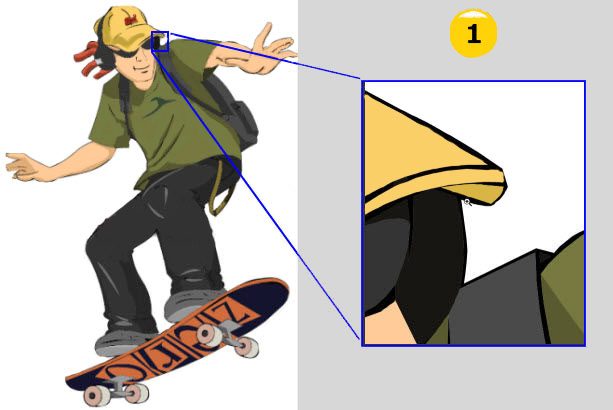

# Imágen de Mapa de Bits 

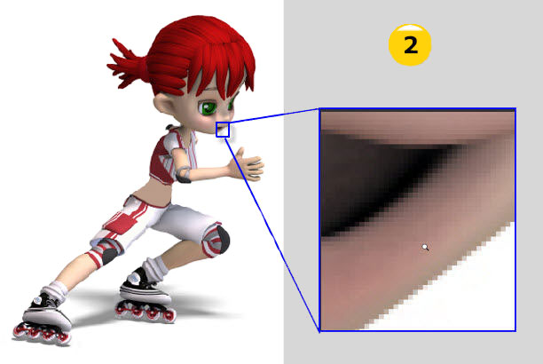

La diferencia es clara cuando acercas la imágen.

En la imágen vectorial todo sigue viendose muy claro (1).
La imágen de mapa de bits se muestra con bloques (2), a los cuales llamamos pixeles.

<!-- <iframe width="560" height="315" src="https://www.youtube-nocookie.com/embed/pbSqU3AdJbM?start=14" title="YouTube video player" frameborder="0" allow="accelerometer; autoplay; clipboard-write; encrypted-media; gyroscope; picture-in-picture; web-share" allowfullscreen></iframe> -->
# Mapa de bits

Las imágenes de mapa de bits (imágenes rasterizadas) que están compuestas por una rejilla o mapa de pequeños cuadrados denominados píxeles.

En un mapa de bits el contenido se representa mediante pequeños puntos rectangulares denominados pixeles. Ampliando lo suficiente una imagen digital (zoom) en la pantalla de un ordenador, pueden observarse los píxeles que componen la imagen.

### <b>DA CLIC A LA IMAGEN PARA VER LA EXPLICACION</b>

⬇️⬇️⬇️⬇️⬇️⬇️⬇️⬇️⬇️⬇️⬇️⬇️⬇️⬇️⬇️⬇️⬇️

# Imágenes Vectoriales

Las imágenes vectoriales se componen de líneas y curvas definidas matemáticamente.
Una imagen vectorial es una imagen digital formada por objetos geométricos independientes (segmentos, polígonos, arcos, etc.), cada uno de ellos definido por distintos atributos matemáticos de forma, de posición, de color, etc. Por ejemplo, un círculo de color rojo quedaría definido por la posición de su centro, su radio, el grosor de línea y su color.

El interés principal de los gráficos vectoriales es poder ampliar el tamaño de una imagen a voluntad sin sufrir la pérdida de calidad que sufren los mapas de bits. De la misma forma, permiten mover, estirar y retorcer imágenes de manera relativamente sencilla.

### **Transformar el Tamaño de un Mapa de Bits en Photoshop** 🖼️✨

Trabajar con mapas de bits en Photoshop nos lleva a enfrentarnos a un dilema muy común: **redimensionar imágenes sin comprometer su calidad.** ¿Por qué esto representa un desafío? Todo tiene que ver con la naturaleza de los píxeles y cómo Photoshop intenta adaptarse a nuestros ajustes.

---

#### **¿Qué sucede cuando cambias el tamaño de una imagen?** 🔎🟩  

Los píxeles, la unidad básica de las imágenes raster, tienen un tamaño fijo. Cuando redimensionas un mapa de bits, Photoshop realiza cálculos matemáticos para adaptar la imagen a las nuevas dimensiones:  

- **Al reducir el tamaño:**  
  Algunos píxeles "sobran". Photoshop debe decidir cuáles conservar y cuáles eliminar. Esto puede llevar a la pérdida de detalles, especialmente en imágenes con elementos finos.  

- **Al agrandar el tamaño:**  
  Aquí radica el mayor desafío. Como no hay suficientes píxeles para llenar el espacio adicional, Photoshop genera nuevos píxeles basados en la información existente. Sin embargo, estos píxeles **"inventados"** no siempre son precisos, lo que puede resultar en bordes borrosos o artefactos indeseados.  

---

#### **¿Por qué las imágenes se pixelean al agrandarlas?** 🤔🖌️  

Cuando haces una imagen más grande, los algoritmos de Photoshop, como el **interpolador bicúbico** o el **suavizado automático**, intentan estimar los colores y detalles para rellenar los huecos. Este proceso es efectivo hasta cierto punto, pero:  
- No puede recrear información inexistente.  
- La ampliación excesiva puede producir áreas desenfocadas o con apariencia "pixelada".  

---

#### **¿Cómo solucionar la pérdida de calidad al redimensionar en Photoshop?** 🛠️✨  

Aunque no podemos cambiar la naturaleza de los píxeles, hay varias estrategias que pueden ayudarte a minimizar los efectos negativos al cambiar el tamaño de una imagen:  

1. **Usa la opción "Tamaño de imagen" sabiamente:**  
   - Ve a **Menú > Imagen > Tamaño de imagen**.  
   - Activa la casilla "Remuestrear" para permitir que Photoshop ajuste los píxeles.  
   - Selecciona el método de interpolación adecuado. Por ejemplo:  
     - **Bicúbico más suave:** Ideal para agrandar imágenes.  
     - **Bicúbico más nítido:** Perfecto para reducir imágenes con detalles finos.  

2. **Trabaja con imágenes de alta resolución:**  
   - Siempre que sea posible, comienza con imágenes de alta calidad y resolución (300 PPP o más). Esto te dará más flexibilidad al redimensionar.  

3. **Utiliza tecnologías avanzadas como "Superresolución":**  
   - Adobe ha integrado inteligencia artificial en Photoshop para mejorar la calidad al redimensionar imágenes. La opción "Superresolución", disponible en Adobe Camera Raw, puede mejorar drásticamente los resultados al agrandar imágenes.  

4. **Aplica un toque final de nitidez:**  
   - Después de redimensionar, ve a **Filtro > Enfocar > Enfoque suavizado** para recuperar detalles y contrarrestar la pérdida de nitidez.  

---

#### **Tips extra para redimensionar como un profesional** 🚀  

- **Evita ampliaciones extremas:** Si necesitas aumentar el tamaño de una imagen de forma significativa, considera dividir el proceso en varios pasos pequeños en lugar de un solo salto grande.  
- **Considera vectores para ciertos proyectos:** Si tu diseño puede ser creado en formato vectorial, como logotipos o iconos, opta por Illustrator o un software similar. Las imágenes vectoriales no enfrentan los mismos problemas al cambiar de tamaño.  

---

### **Domina el tamaño sin perder calidad** 🖼️💡  

Redimensionar mapas de bits es un arte que combina conocimiento técnico y creatividad. Entender cómo funcionan los píxeles y utilizar las herramientas correctas de Photoshop te permitirá obtener los mejores resultados posibles, ya sea al agrandar o reducir imágenes.  

Recuerda, aunque los píxeles tienen sus limitaciones, las posibilidades creativas de Photoshop no las tienen. Con práctica y las estrategias adecuadas, podrás superar cualquier desafío relacionado con el tamaño de tus imágenes.  

**¿Listo para transformar tus mapas de bits sin perder calidad?** 🚀 ¡Es hora de poner en práctica todo lo aprendido y llevar tus proyectos al siguiente nivel!  

# Modos de Color en Photoshop: RGB, CMYK, Escala de Grises y LAB

Photoshop ofrece varios modos de color que se adaptan a diferentes necesidades y entornos. Cada uno tiene características específicas que lo hacen ideal para ciertos tipos de proyectos. A continuación, exploraremos los modos de color más comunes, sus diferencias y cómo utilizarlos.

---

## **1. RGB (Rojo, Verde, Azul)**  
### ¿Qué es?  
El modo RGB utiliza los colores primarios de la luz (rojo, verde y azul) para crear una amplia gama de colores. Es un modelo **aditivo**, lo que significa que los colores se forman al sumar luz.

### ¿Dónde se usa?  
- **Pantallas digitales:** Diseños web, redes sociales, aplicaciones móviles, videos y cualquier contenido que se visualice en dispositivos electrónicos.

### Ventajas:  
- Amplia gama de colores brillantes.  
- Ideal para proyectos digitales.  

### ¿Cómo usarlo en Photoshop?  
1. Ve a **Imagen > Modo > Color RGB**.  
2. Trabaja con colores vivos y utiliza herramientas como el **Selector de Color** para obtener tonos precisos.  
3. Exporta en formatos como PNG o JPEG para uso digital.

---

## **2. CMYK (Cian, Magenta, Amarillo, Negro)**  
### ¿Qué es?  
El modo CMYK es un modelo **sustractivo** que utiliza tintas para crear colores al restar luz reflejada en el papel. Es el estándar para impresión.

### ¿Dónde se usa?  
- **Impresión:** Revistas, carteles, folletos, empaques y cualquier material físico.

### Ventajas:  
- Compatible con procesos de impresión.  
- Permite obtener colores más realistas en papel.  

### ¿Cómo usarlo en Photoshop?  
1. Cambia a **CMYK Color** desde **Imagen > Modo**.  
2. Usa **Vista > Prueba de color** para previsualizar cómo se verá tu diseño al imprimirse.  
3. Consulta con la imprenta para asegurarte de que el perfil de color sea compatible.

---

## **3. Escala de Grises**  
### ¿Qué es?  
En este modo, los colores se representan en tonos de gris, basados en la intensidad de luz de cada píxel.

### ¿Dónde se usa?  
- **Fotografía artística:** Proyectos en blanco y negro.  
- **Impresión monocromática:** Documentos o gráficos simples.  

### Ventajas:  
- Resalta el contraste y la textura.  
- Simplifica la composición visual.  

### ¿Cómo usarlo en Photoshop?  
1. Cambia el modo a **Escala de Grises** desde **Imagen > Modo**.  
2. Experimenta con ajustes como **Brillo/Contraste** para mejorar la calidad visual.  
3. Exporta en formatos como TIFF o JPEG para impresión o uso digital.

---

## **4. LAB (Luminosidad, A y B)**  
### ¿Qué es?  
El modelo LAB organiza los colores basándose en la percepción humana:  
- **L:** Luminosidad (de negro a blanco).  
- **A:** Colores entre verde y magenta.  
- **B:** Colores entre azul y amarillo.

### ¿Dónde se usa?  
- **Corrección de color avanzada:** Ajustes precisos de tonalidad y brillo.  
- **Restauración de fotografías:** Proyectos que requieren transiciones suaves y gradientes.  

### Ventajas:  
- Amplia gama de colores, incluso más que RGB y CMYK.  
- Excelente para ajustes detallados.  

### ¿Cómo usarlo en Photoshop?  
1. Cambia a **LAB Color** desde **Imagen > Modo**.  
2. Trabaja en los canales individuales (**L**, **A**, y **B**) para ajustes específicos de color.  
3. Convierte a RGB o CMYK antes de exportar según el destino del proyecto.

---

## **Diferencias Clave entre los Modos de Color**  

| **Modo**       | **Uso Principal**       | **Ventajas**                          | **Limitaciones**                     |
|-----------------|-------------------------|---------------------------------------|---------------------------------------|
| **RGB**         | Pantallas digitales     | Amplia gama de colores brillantes     | No apto para impresión directa.      |
| **CMYK**        | Impresión               | Colores realistas en papel            | Gama de colores más limitada.        |
| **Escala de Grises** | Blanco y negro       | Resalta contraste y textura           | Sin colores, solo tonos de gris.     |
| **LAB**         | Corrección avanzada     | Amplia gama de colores y precisión    | No es compatible directamente con impresión o web. |

---

## **Consejos para Elegir el Modo Correcto**  
1. **Proyectos digitales:** Usa RGB para aprovechar la gama de colores brillantes.  
2. **Impresión:** Trabaja en CMYK desde el inicio para evitar discrepancias de color.  
3. **Fotografía en blanco y negro:** Usa Escala de Grises para resaltar detalles y contraste.  
4. **Edición avanzada:** Usa LAB para ajustes precisos y luego convierte al modo final según el destino del proyecto.

Conocer y dominar los modos de color en Photoshop te permitirá optimizar tus proyectos y garantizar resultados profesionales en cualquier entorno. 🎨

# Configuración nuevo proyecto en photoshop

✅ Photoshop maneja tamaños predeterminados. Nos ayuda a ahorrar tiempo y nos brinda información exacta.

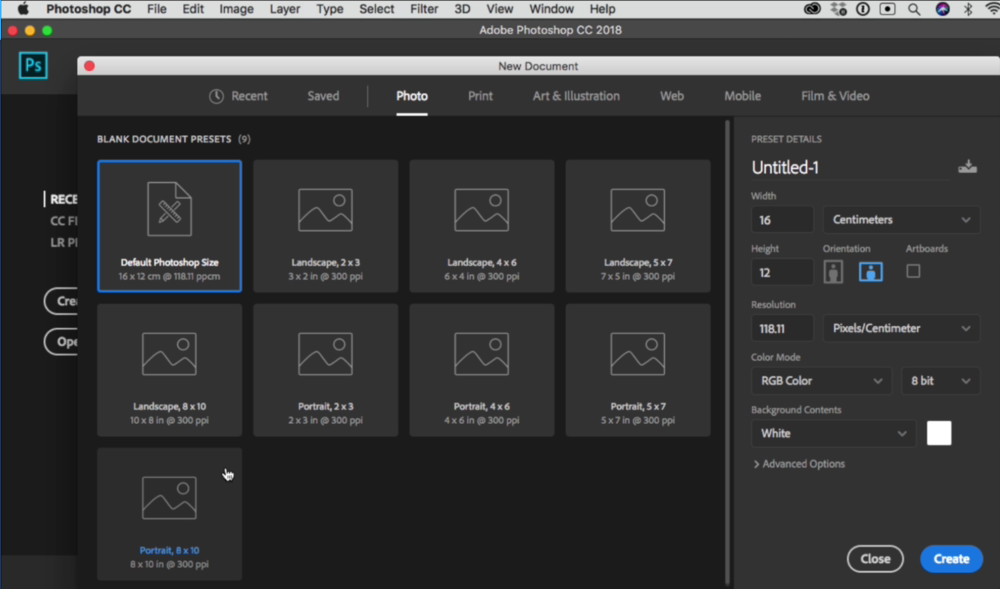

<b>RESOLUCIÓN DE DOCUMENTO:</b>

*Siempre debemos preguntarnos ¿para qué estamos trabajando?*

**La medida ideal** en PPP (Pixeles Por Pulgada) para dispositivos digitales es de 72 PPP y de 300 PPP para impresión, especialmente a gran escala.

* <i>**Impresión:** 300 pixels/inch</i>
* <i>**Digital:** 72 pixels/inch</i>

<b>MODO DE COLOR:</b>

*Siempre debemos preguntarnos ¿para qué estamos trabajando?*

**El perfil de color** ideal para impresión es el CMYK (que son los colores Cian o “azul claro”, Magenta o “rosa”, Yellow “amarillo” y Black “negro”) y para digitales sRGB o RGB ( RED rojo, GREEN verde y BLUE azul) para que no haya mucha diferencia de colores entre dispositivos.

* <i>**Impresión:** CMYK || 16 bits = **C**ian - **M**agenta - **Y**ellow - blac**K**</i>
* <i>**Digital:** RGB || 16 bits = **R**ed - **G**reen – **B**lue</i>

<b>PERFIL DE COLOR:</b>

* **En RGB:** sRGB IEC61966-21
* **En CMYK:** COATED FOGRAF 39
* **8 Bit:** Digital
* **16 Bit:** Fotografía

**ASPECTO DEL PÍXEL:**

<i>Por los televisores de antes, se debía definir la forma del pixel, pero ahora todos son cuadrados.</i>

# Espacio De Trabajo: Paneles y Herramientas de Photoshop

# BARRA DE HERRAMIENTAS DE LA IZQUIERDA

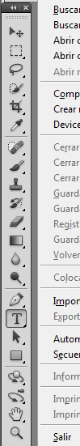

* Se trabaja comúnmente con las herramientas preseleccionadas.
* Hay herramientas que tienen más herramientas dentro de sí.

# BARRA DE HERRAMIENTAS DE LA DERECHA

* Los paneles de herramientas, están divididos en pestañas.
* Los paneles son son configurables en su tamaño y ubicación.

# WINDOWS | VENTANA

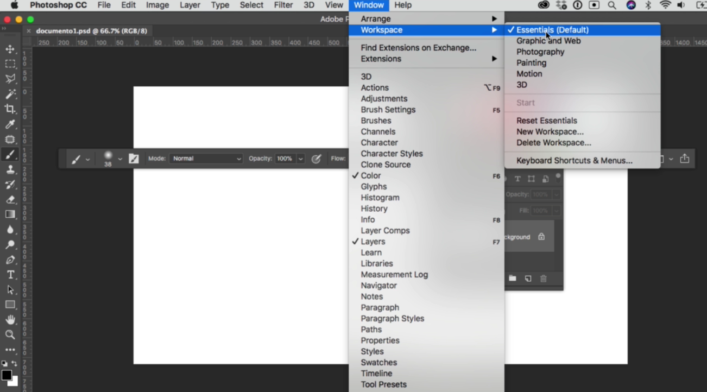

* Muestra y detalla todas las herramientas principales.
* Muestra con una check las ventanas activas de nuestros paneles.

# BARRA SUPERIOR

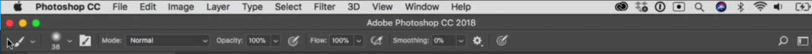

* Muestra propiedades de la herramienta que tenemos seleccionada.
* Todos los paneles son configurables y colapsables.

✔ Organizar espacio de trabajo: Windows → workspace / espacio de trabajo:

✔ Photoshop permite, de manera ordenada, trabajar con varios documentos por medio de pestañas.

# Los paneles de Photoshop 

La barra de paneles agrupa las funciones que Photoshop es capaz de realizar según sus características:

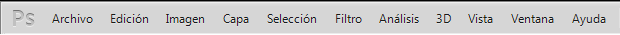

# Panel Archivo:
En el panel Archivo encontraremos funciones referentes a nuestro documento, como nuevo, abrir, cerrar, guardar, exportar, etc.

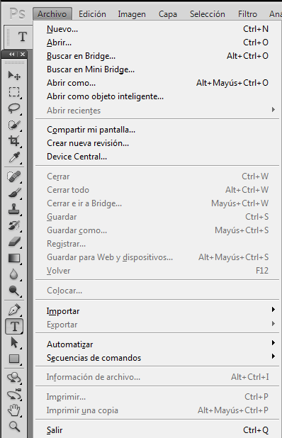

# Edición:

Agrupa las funciones para editar capas o objetos de nuestro documento. Desde esta ventana podemos entre otras cosas: copiar, cortar, pegar, deshacer y escalar.

# Panel Capa:
Son las funciones para creación y manipulación de capas con opciones como: nuevo, duplicar, borrar, agrupar, organizar, etc.

**Panel Selección:**

Aquí encontramos las funciones para seleccionar todo en una capa, deseleccionar, crear máscaras, etc.

# Panel Filtro:
En este panel están todos los filtros que Photoshop puede aplicar. Un filtro es una función que realiza una serie de acciones sobre el documento para añadirle un efecto como que una foto se vea como si estuviese pintada a mano. Existe una gran cantidad de filtros con los que se puede ir jugando.

El panel filtros y el resto de paneles que no hemos explicado, no se verán en este tutorial.

# Panel Ventana:
Este panel es muy importante y a veces poco conocido. Desde aquí abriremos otras ventanas que tienen su propio panel de control desde donde poder trabajar más opciones de una misma herramienta.

En ocasiones, podemos querer cerrar algunas de las ventanas o bien, la habremos cerrado sin querer, en ese caso acudiremos al panel Ventana para volver a abrir aquellas que necesitemos o hubiésemos cerrado accidentalmente.

# Las herramientas del Photoshop
En cualquier oficio es indispensable disponer de las herramientas adecuadas para su desarrollo sin embargo, Photoshop no es cualquier oficio y dispone de una gran cantidad de ellas para realizar una gran cantidad de cosas.

Como en todo oficio comenzaremos hablando de las herramientas elementales para ir perfeccionando a lo largo del tiempo hasta otras más complejas. Antes de empezar a crear, debemos saber de qué herramientas disponemos y qué podemos hacer con ellas.

# Herramientas Habituales

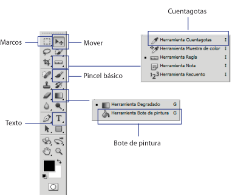

# Herramienta Mover:
Esta herramienta es la que usaremos para mover cualquier cosa mientras estamos trabajando.

# Selección de marcos:
Disponemos de distintas formas geométricas con las que realizaremos la selección, como un rectángulo o una elipse. Si no elegimos ninguna utilizará la forma rectangular para realizar la selección.

# Cuentagotas:
Esta herramienta nos permite seleccionar un color que haya en la imagen.

# Pincel básico:
Como la selección de marcos también tiene varias opciones para elegir, en esta entrega utilizaremos el pincel pero la explicación sirve también para el lápiz.

Cuando seleccionamos una herramienta se muestralas opciones que tiene. La herramienta pincel simula un pincel real y sirve para hacer trazos. Podemos seleccionar el grosor y la intensidad, es decir más o menos suavidad a la hora de pintar.

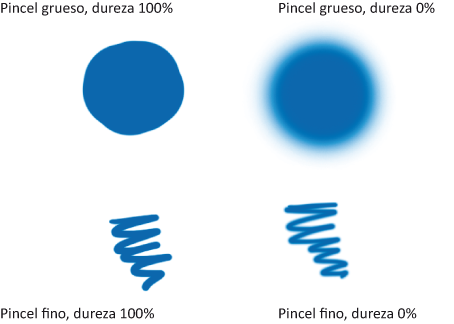

# Bote de pintura:
Esta herramienta cambia el color de una zona. Las zonas se forman por colores, así si un borde es blanco, todo el borde será una zona blanca.

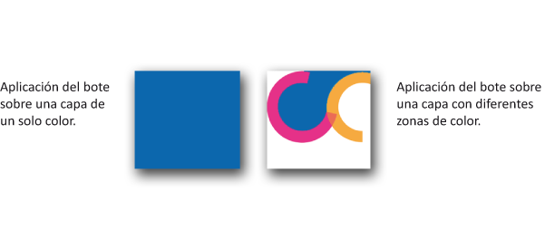

# Texto:
Esta herramienta crea una nueva capa de texto directamente en nuestro documento.

# Administrador de archivos

El manejo de archivos es algo que ya se ha estado manejando en cada una de las fases que has tomado. A continuación se da la descripcion y método abreviado de cada una de ellas.

|**Comando**|**Método abreviado**|**Descripción**|
|--|--|--|
|**Abrir**|Ctrl + O|Permite abrir un archivo existente.|
|**Guardar**|Ctrl + S|Guarda el archivo actual.|
|**Guardar como**|Ctrl + Shift + S|Guarda el archivo especificado un nombre y una ubicación.|
|**Nuevo**|Ctrl + N|Permite crear un archivo.|
|**Cerrar**|Ctrl + W|Cierra un archivo.|
|**Salir**|Ctrl + Q|Cierra el programa.|

Cabe mencionar que cada una de estas opciones se encuentra en le menú de **Archivo**

La extención con la que se guardan los archivos de *Photoshop* es .PSD y .PDD (*Archivos sin terminar*); sin embargo, las imagenes se pueden guardar en cualquiera de los siguientes formatos:

# Formatos de archivo de Photoshop

Photoshop soporta más de 20 formatos de archivo. Desde el cuadro de diálogo de “Abrir” y “Guardar” podemos ver los distintos formatos que soporta. Puede soportar incluso más formatos mediante la adición de plugins que añaden comandos a los submenús “Guardar cómo”, “Importar” y “Exportar” del menú Archivo.

# Los formatos más utilizados son:
**PSD, PDD:** formato estándar de Photoshop con soporte de capas.

**PostScript:** no es exactamente un formato, sino un lenguaje de descripción de páginas. Se suele encontrar documentos en PostScript. Utiliza primitivas de dibujo para poder editarlo.

**EPS:** es una versión de PostScript, se utiliza para situar imágenes en un documento. Es compatible con programas vectoriales y de autoedición.

**DCS:** fue creado por Quark (empresa de software para autoedición) y permite almacenar tipografía, tramas, etc. Se utiliza para filmación en autoedición.

**Prev. EPS TIFF:** permite visualizar archivos EPS que no se abren en Photoshop, por ejemplo, los de QuarkXPress.

**BMP:** formato estándar de Windows.

**GIF:** muy utilizado para las webs. Permite almacenar un canal alfa para dotarlo de transparencia, y salvarlo como entrelazado para que al cargarlo en la web lo haga en varios pasos. Admite hasta 256 colores.

**JPEG:** también muy utilizado en la WWW, factor de compresión muy alto y buena calidad de imagen.

**TIFF:** una solución creada para pasar de PC a MAC y viceversa.

**PICT:** desde plataformas MAC se exporta a programas de autoedición como QuarkXPress.

**PNG:** la misma utilización que los GIF, pero con mayor calidad. Soporta transparencia y colores a 24 bits. Solo las versiones recientes de navegadores pueden soportarlos.

**PDF:** formato original de Acrobat. Permite almacenar imágenes vectoriales y mapa de bits.

**IFF:** se utiliza para intercambio de datos con Amiga.

**PCX:** formato solo para PC. Permite colores a 1, 4, 8 y 24 pixels.

**RAW:** formato estándar para cualquier plataforma o programa gráfico.

**TGA:** compatible con equipos con tarjeta gráfica de Truevision.

**Scitex CT:** formato utilizado para documentos de calidad profesional.

**Filmstrip:** se utiliza para hacer animaciones. También se puede importar o exportar a Premiere.

**FlashPix:** formato originario de Kodak para abrir de forma rápida imágenes de calidad superior.

# Cómo guardar un archivo de Photoshop y extensiones de archivo

Guardaremos el documento ahora y posteriormente utilizaremos la combinación de teclas Ctrl + S (comando + S) en MacOS. En cualquier caso, el procedimiento para guardar el documento es el siguiente:

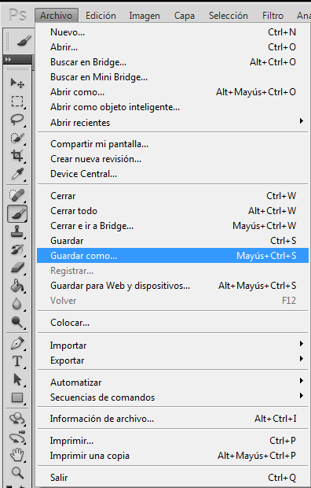

En el panel Archivo hacemos click en la función Guardar como. La ventana «Guardar Como…» es la que nos indica la ruta (sitio donde se guarda el fichero PSD) y el formato (tipo de archivo de trabajo que será normalmente Photoshop) en que guardaremos nuestro documento.

En cuanto al formato, comentaremos algunos tipos de formatos más típicos para las páginas web y el nativo de Photoshop. Usaremos uno u otro según su finalidad.

# Archivos PSD
El archivo .PSD es el formato nativo de Photoshop y será nuestro archivo abierto de trabajo. Esto significa que nos mantendrá las capas, el texto, los efectos, las distintas imágenes, todo por separado, sin acoplar. Este archivo será el que guardemos durante el proceso de trabajo para poder abrir y modificar en cualquier momento.

# La extensión PNG:
Este es un formato web que nos conviene utilizar en los casos en que nuestros banners estén compuestos por transparencias, aunque su uso es también recomendable para imágenes con colores planos, es decir, pocos colores en total, todo lo contrario que una foto.

# Extensiones GIF:
Este también es un formato típico de web y lo utilizaremos, sobre todo, cuando tengamos que crear una secuencia de imágenes. Al igual que el .PNG permite transparencias, pero de menor calidad. Es recomendable para colores planos y sin fotos, pero no aguanta las transparencias tan bien como el .PNG, con lo cual lo podremos elegir en imágenes con colores planos que no necesiten transparencia. Normalmente el archivo .GIF suele pesar menos que él .PNG y por ello es más conveniente según qué casos.

# Formatos JPG:
Utilizaremos este formato para los banners que tengan fotos, solas o con otros elementos gráficos, porque en este caso un .JPG bien optimizado pesa mucho menos que un .PNG.

# Shorcuts Photoshop

👉[HAZ CLIC AQUI](https://helpx.adobe.com/es/photoshop/using/default-keyboard-shortcuts.html)👈

### Practica 1: Escalar imagen
imagen practica 1

# Capas: Que son las capas de Photoshop y cómo trabajar con las capas

Las capas de Photoshop semejan hojas apiladas de acetato. Puede ver las capas que se encuentran debajo a través de las áreas transparentes de una capa. Cuando creamos un archivo nuevo, en la ventana capas veremos que ya existe una capa y que se llama Fondo.

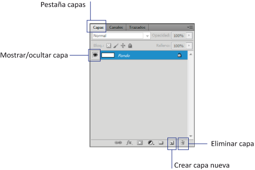

Con cada nuevo elemento añadiremos una capa nueva y también lo haremos al usar cualquier herramienta. Ciertas herramientas, al usarlas sobre el documento, ya **nos añaden su propia capa**, como por ejemplo la herramienta de texto. Sin embargo, otras, como el bote de pintura o los pinceles no lo hacen.

Por ello antes de usar estas herramientas debemos crear una nueva capa para no actuar sobre la existente. Las capas nos permiten añadir efectos, transparencias, hacer fusiones entre varias capas y otras muchas cosas. **¿Y qué conseguimos al tener nuestro archivo montado en capas?**

Conseguimos tener un documento de trabajo abierto a posibles **modificaciones** futuras, que nos facilitarán el trabajo y nos evitarán tener que rehacer toda una imagen o hacer algún arreglo rápido, para cambiar un simple texto o borrar un gráfico que ya no nos gusta.

Un documento cerrado y listo es lo que se llama Arte final. Para modificaciones futuras, utilizaremos el archivo .PSD que es que el llevaremos guardando durante todo el proceso de trabajo.

# Tipos de capas

Photoshop genera diferentes tipos de capas de manera predeterminada; al crear una capa se maneja como mapa de bits pero al momento de utilizar texto, o bien colocar una imagen, se crea su **Tipo de capa.**

* **Fondo:** Se genera cuando abre una imagen, o bien se crea un documento nuevo, y se está trabajando directamente en ella; cabe senalar que, mientras sea un fondo, se mantendrán bloqueadas las propiedades que tenga, como la opacidad, eI relleno, etcétera.  
Para desbloquear Ia imagen, basta con dar doble clic sobre ella y entonces
se convierte en "capa cero".

* **Objeto inteligente:** Los objetos inteligentes se encuentran en capas que contienen datos de imágenes rasterizadas o vectoriales; por ejemplo, archivos de Photoshop o Illustrator. Los objetos inteligentes conservan el contenido original de la imagen con todas sus caracteristicas originales. de tal manera que posibilitan la edición no destructiva de la capa. Los objetos inteligentes se pueden crear de varias formas: con el comando **Abrir como objeto inteligente**, mediante la colocación de un archivo, al pegar datos de Illustrator.

* **Formas:** Conservan las formas vectoriales creadas con las herramientas de Forma o con las de Pluma. En realidad, es una capa de relleno con un trazado de recorte de capa. La primera define el color de la figura vectorial, y el trazado define su contorno.

* **Capa de texto:** Se genera una nueva capa de texto cada vez que se inserta texto, de forma automatica se nombra con los caracteres escritos. Estas capas son transparentes, salvo el área cubierta por el propio texto. Estas capas son especiales, no son modificables como las de imagen. no se puede pintar sobre ellas, por ejemplo. Cuando se estå seguro de que no se va a querer modificar el texto y que éste es definitivo se puede convertir la capa de texto a una capa de imagen. Para esto active el menú **Capa** opción **Rasterizar texto.**

# Panel de capas

El Panel de Capas permite controlar y gestionar todas las capas. El orden en el que aparecen las capas indica su orden real de apilamiento.La capa activa se visuahza en azul. La casilla situada más a la izquierda, que muestra un icono en forma de ojo, es la que controla la visibilidad. Haciendo cltc sobre eI ojo. la capa se oculta. y si estå ocuita, al hacer clic se visualiza. En la barra de abajo de la paleta Capas hay botones para:

* Ariadir estilo de capa
* Ariadir máscara de capa
* Crear grupos
* Crear capa de relleno a ajuste
* Crear capa y eliminar capa

# Organizar capas

Reordenar capas: Desde la paleta Capas se hace clic sobre la capa que se quiere desplazar y se arrastra hasta la nueva posición.

Grupos de capas: Las imagenes complejas con mochas capas conviene organizarlas en grupos que reúnen capas en una carpeta. Para crear un grupo se puede usar el botón Crear grupo nuevo.

Duplicar capas: Se puede duplicar una capa o conjunto de capas en un mismo documento o en otro distinto <CtrI + J>.

Combinación de capas: Consiste en fundir, agrupar las capas. Solo los
formatos .PSD y .PDF admiten capas. Se puede hacer de tres formas:

1. Menú Capa opción Combinar hacia abajo <CtrI + E>: funde Ia capa que está activa con la inmediatamente inferior.

2. Menú Capa opción Combinar visibles <Mayús + Ctrl + E>: combina todas las capas visibles en ese momento.

3. Menú Capa opción Acoplar imagen: agrupa todas las capas de la imagen.

# Selección de capas

1. Haga clic en una capa de la paleta Capas.

2. Para seleccionar varias capas contiguas, haga clic en la primera capa, pulse
la tecla <Mayús> y haga clic en la última capa.

3. Para seleccionar varias capas no contiguas, pulse \<Ctrl>.

4. Para seleccionar todas las capas, vaya al menú Selección, opcion Todas las capas. O mediante la combinaciön de teclas \<Alt + Ctrl + A>

# Rasterización de capas

Algunos comandos y herramientas, como los efectos de filtro y las herramientas de pintura, no estån disponibles para capas de texto. Para poder aplicar el comando o utilizar la herramienta, antes debe rasterizar el texto. Rasterizar convierte la capa de texto en una capa normal y hace que su contenido sea imposible de editar como texto. Si selecciona un comando o una herramienta que requiere una capa rasterizada, aparece un mensaje de advertencia. Algunos mensajes de aviso presentan un botón OK en el que puede hacer clic para rasterizar la capa.

También podra rasterizar los siguientes objetos:

* Texto: Rasteriza el texto en una capa de texto. No rasteriza ningún Otro dato vectorial de la capa.

* Forma: Rasteriza una capa de formas.

* Contenido de relleno: Rasteriza el relleno de una capa de formas sin
incluir la mascara vectorial.

* Máscara vectorial: Rasteriza la máscara vectorial de una capa y la convierte en una máscara de capa.

* Objeto inteligente: Convierte un objeto inteligente en una capa rasterizada.

* Video: Rasteriza el cuadro de video actual en una capa de imagen.

* 3D (solo en Extended): Rasteriza la vista actual de datos tridimensionales en una capa rasterizada Plana.

* Capa: Rasteriza todos los datos vectoriales de las capas seleccionadas.

* Todas las capas: Rasteriza todas las capas que contienen datos generados y vectoriales.

# **Modos de Fusión**

Los **modos de fusión** en Photoshop son herramientas poderosas que permiten transformar nuestras imágenes mediante la interacción entre capas. Estos modos, disponibles en las opciones de capa y en ciertas herramientas, controlan cómo los píxeles de una capa interactúan con los de otra, afectando aspectos como el color, la luminosidad y la transparencia. Aunque inicialmente parecen complejos, con esta guía podrás comprenderlos y aplicarlos para lograr resultados sorprendentes.  

---

## **¿Qué son los modos de fusión?**

Los modos de fusión determinan cómo una capa interactúa con otra visualmente. Por ejemplo, al trabajar con transparencias, luces o sombras, puedes lograr efectos específicos al elegir el modo adecuado.  
Los modos se agrupan en categorías según el tipo de efecto que generan: **Normales**, **Oscuros**, **Claros**, **Contraste**, **Inversión**, **Cancelación**, y **Por componente**.

## **Categorías y sus aplicaciones prácticas**

### **1. Modos normales**
- **Normal**: Es el predeterminado. Los píxeles superiores se muestran según su opacidad. Útil para combinar elementos básicos sin efectos.
- **Dissolve / Disolver**: Crea una textura aleatoria de píxeles transparentes al reducir la opacidad, generando un efecto "desgastado".

normal

disolver
  

---

### **2. Modos oscuros**
Estos modos ignoran los colores claros y destacan los más oscuros.  

- **Darken / Oscurecer**: Mantiene el píxel más oscuro entre las capas. Ideal para eliminar blancos de imágenes.
- **Multiply / Multiplicar**: Multiplica los valores de color de ambas capas, oscureciendo la imagen. Muy útil para agregar sombras o texturas.  
- **Color Burn / Subexponer Color**: Similar a Multiply, pero con mayor saturación y contraste.
- **Linear Burn / Subexposición Lineal**: Oscurece disminuyendo el brillo de la capa base.
- **Darker Color / Color más oscuro**: Compara los colores RGB completos para seleccionar el más oscuro.

oscurecer

multiplicar
  

Pixel superior: R38, G169, B234
Pixel base: R40, G234, B105

la operación de asignar modo multiplicar será la siguiente:

R: ( 38 x 40 ) / 255 = 5.9 redondeado a 6
G: ( 169 x 234 ) / 255 = 155
B: ( 234 x 105 ) / 255 = 96.3 redondeado a 96

Nuestro color resultante es entonces R:6 G:155 B:96

En la práctica es un modo de fusión muy útil para agregar textura o integrar imágenes.

multiplicar
 

Subexponer Color
  

Subexposición Lineal

Color más oscuro

---

### **3. Modos claros**
Destacan los colores más brillantes e ignoran los oscuros.  

- **Lighten / Aclarar**: Entrega el píxel más claro entre las capas.
- **Screen / Trama**: Genera colores más brillantes, perfecto para reflejos.
- **Color Dodge / Sobreexponer Color**: Realza los colores claros con mayor saturación.
- **Linear Dodge (Add) / Sobreexposición Lineal**: Brillante, pero con menos saturación que Color Dodge.
- **Lighter Color / Color más claro**: Similar a Lighten, pero sin mezclar colores.

Aclarar

Trama

sobre exponer color

Sobreexposición Lineal

---

### **4. Modos de mezcla por contraste**
Combinan lo mejor de los modos claros y oscuros, destacando luces y sombras.  

- **Overlay / Superponer**: Aumenta el contraste; los tonos medios se vuelven transparentes.
- **Soft Light / Luz suave**: Sutil, ideal para ajustes de iluminación.
- **Hard Light / Luz fuerte**: Genera alto contraste, combinando luces y sombras intensas.
- **Vivid Light / Luz intensa**: Una versión extrema de Overlay, con saturación y contraste elevados.

Superponer

Luz suave

Luz fuerte

Luz intensa

---

### **5. Modos "invertidos"**
Invierten los valores de color para crear efectos sorprendentes.  

- **Difference / Diferencia**: Invierte colores basándose en su diferencia.
- **Exclusion / Exclusión**: Similar a Difference, pero menos agresivo con tonos grises.

Diferencia
  

Exclusión

---

### **6. Modos de cancelación**
Tienden al blanco o al negro, reduciendo la información de color.  

- **Subtract / Restar**: Reduce valores de color, oscureciendo.
- **Divide / Dividir**: Genera zonas brillantes al dividir valores de color.

  

---

### **7. Modos por componente**
Trabajan sobre los componentes HSV (matiz, saturación y brillo).  

- **Hue / Matiz**: Aplica el matiz de la capa superior manteniendo el brillo y la saturación de la capa base.
- **Saturation / Saturación**: Afecta la saturación de la base según la capa superior.
- **Color**: Mezcla matiz y saturación de la capa superior para dar color a imágenes en blanco y negro.
- **Luminosity / Luminosidad**: Mantiene el matiz y saturación de la base, pero aplica el brillo de la capa superior.

matiz
  

saturacion

color

luminosidad

---

Ahora que comprendes cómo funcionan los modos de fusión, no es necesario memorizarlos todos. **Entender los grupos es clave** para saber dónde buscar según el efecto deseado.  

Mis recomendaciones:  
- Usa **Multiply** para integrar sombras realistas.  
- **Screen** es ideal para reflejos o iluminación.  
- **Overlay** y **Soft Light** funcionan bien para ajustes sutiles de contraste.  

¿Cuál es tu modo favorito y cómo lo usas? ¡Compártelo y sigamos aprendiendo juntos! 🎨

### **Máscaras de Capa** 🎭✨  

¿Alguna vez has deseado editar una imagen en Photoshop sin miedo a cometer errores irreversibles? Las **máscaras de capa** son tu mejor aliada. Esta poderosa herramienta permite ocultar, revelar o combinar elementos sin destruir tu trabajo original. En pocas palabras, las máscaras de capa son el pincel mágico que transforma cualquier proyecto en arte sin límites.  

### **¿Qué es una máscara de capa?** 🎨  

Una **máscara de capa** funciona como un escudo entre tu imagen y las ediciones que aplicas. Es una capa especial que utiliza colores (blanco, negro y tonos de gris) para controlar la visibilidad de los píxeles:  

- **Blanco:** Revela todo el contenido de la capa.  
- **Negro:** Oculta completamente el contenido.  
- **Gris:** Oculta parcialmente según la intensidad del tono (cuanto más oscuro, menos visible será).  

La mejor parte: ¡es completamente reversible! Si algo sale mal, siempre puedes corregirlo sin afectar la imagen original.  

### **¿Por qué usar máscaras de capa?** 🧰  

- **Edición no destructiva:** Realiza cambios sin alterar permanentemente tus imágenes.  
- **Transiciones suaves:** Crea efectos de fusión y degradados perfectos entre capas.  
- **Control total:** Decide exactamente qué partes de la capa serán visibles o invisibles.  
- **Flexibilidad creativa:** Combina elementos, ajusta colores o elimina fondos de manera precisa.  

### **¿Cómo usar una máscara de capa?** 🖌️  

#### **Paso 1: Añadir una máscara de capa**  
1. Selecciona la capa en la que quieres trabajar. 

2. Haz clic en el ícono de **Máscara de capa** en la parte inferior del panel de capas (parece un rectángulo con un círculo dentro). 

   

 
3. Photoshop añadirá una máscara blanca (totalmente visible) junto a la miniatura de tu capa.  

   

#### **Paso 2: Pinta sobre la máscara**  
1. Selecciona el pincel (tecla **B**) y asegúrate de que los colores de frente y fondo sean blanco y negro.  

   

   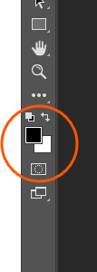

2. Pinta con **negro** para ocultar partes de la capa. Cambia a **blanco** para revelar lo que has ocultado.  

   

3. Ajusta la opacidad del pincel para crear efectos más suaves.  

   

#### **Paso 3: Invertir la máscara**  
¿Quieres que todo comience oculto? Selecciona la máscara y presiona **Ctrl + I** para invertir los colores (de blanco a negro).  

   

### **Ejemplos de uso de máscaras de capa** 🌟  

#### **1. Eliminar fondos fácilmente**  
- Añade una máscara de capa a tu imagen.  
- Con un pincel negro, pinta el fondo que deseas ocultar. Usa un pincel suave para bordes precisos.  

#### **2. Crear efectos de fusión**  
- Superpón dos imágenes y añade una máscara a la capa superior.  
- Usa un degradado (herramienta de degradado o tecla **G**) en la máscara para fusionar suavemente las imágenes.  

   

#### **3. Ajustes localizados**  
- Aplica un ajuste de brillo, contraste o color a toda la imagen.  
- Añade una máscara de capa al ajuste y pinta con negro en las áreas que no quieres modificar.  

   

### **Consejos pro para trabajar con máscaras de capa** 🧙‍♂️  

1. **Usa selecciones inteligentes:** Antes de pintar, crea selecciones precisas con herramientas como el lazo, selección rápida o pluma.  
2. **Duplica tu máscara:** Si necesitas probar algo nuevo, duplica la máscara para mantener una copia del trabajo original.  
3. **Aplica filtros a la máscara:** Experimenta con desenfoques o texturas en la máscara para obtener efectos únicos.  
4. **Combínala con clipping masks:** Usa máscaras de capa junto con máscaras de recorte para un control aún más detallado.  

Dominar las máscaras de capa es como tener un superpoder en Photoshop. Te dan la libertad de experimentar, corregir y ajustar sin el temor de perder horas de trabajo. Ya sea que quieras eliminar fondos, realizar ajustes localizados o crear transiciones perfectas, esta herramienta es imprescindible para todo diseñador o fotógrafo.  

💡 **Pregunta del día:** ¿Cómo usas tú las máscaras de capa? ¡Cuéntanos tus trucos y técnicas en los comentarios para seguir aprendiendo juntos!

## 👉[Practica Inspiración en el Modernismo Suizo](./Practics/05_Inspiración%20en%20el%20Modernismo%20Suizo/Inspiración%20en%20el%20Modernismo%20Suizo.md)👈

# Edición Avanzada de Capas en Photoshop: Estilos y Efectos Preestablecidos  

En el vasto mundo de Photoshop, la edición de capas no solo se limita a recortes, ajustes de color o modos de fusión. Los **estilos y efectos preestablecidos** son herramientas poderosas que llevan tu diseño al siguiente nivel, permitiéndote agregar profundidad, dinamismo y profesionalismo a tus proyectos con unos cuantos clics. En esta guía, exploraremos cómo usar **las bibliotecas de estilos**, la **ventana de estilos** y cómo sacar el máximo provecho de esta funcionalidad.

---

## **¿Qué son los estilos de capa?**  

Los estilos de capa son combinaciones predefinidas de efectos que puedes aplicar directamente a una capa. Estos incluyen sombras, relieves, bordes, brillos y más. Lo mejor de todo es que los estilos son completamente editables, lo que te permite personalizarlos según tus necesidades.  

Ejemplo: ¿Quieres que un texto tenga un brillo neón? Aplica un estilo preestablecido y ajústalo para crear el efecto perfecto.  

---

## **Ventana de Estilos: Tu Centro de Creación**  

La ventana de estilos en Photoshop es el lugar donde puedes acceder rápidamente a los efectos preestablecidos y personalizarlos. Para abrirla:  
1. Ve a **Ventana** en el menú superior.  
2. Selecciona **Estilos**.  

    

Aquí encontrarás una lista de estilos organizados en categorías. Al hacer clic en cualquier estilo, este se aplicará instantáneamente a la capa seleccionada.  

---

## **Explorando las Bibliotecas de Estilos**  

Photoshop ofrece bibliotecas de estilos que puedes cargar y usar. Estas bibliotecas incluyen opciones para:  
- **Texto metálico** (oro, plata, cromo).  
- **Efectos de vidrio** (cristal transparente, vidrios de colores).  
- **Sombras realistas** para objetos.  
- **Brillos y resplandores suaves**.  

Para cargar una biblioteca:  
1. Haz clic en el menú de la ventana de estilos (esquina superior derecha).  
2. Selecciona **Cargar estilos**.  
3. Explora y selecciona un archivo .ASL, que contiene los estilos preestablecidos.  

---

## **Cómo Personalizar un Estilo**  

Aunque los preestablecidos son útiles, la magia ocurre al personalizarlos. Sigue estos pasos:  

1. **Aplica un estilo base** desde la ventana de estilos.  
2. Haz doble clic en la capa para abrir la ventana de **Opciones de fusión**.  
3. Ajusta los efectos como:  
   - **Sombra paralela**: Cambia la distancia y el ángulo para agregar realismo.  
   - **Resplandor exterior**: Modifica el tamaño y el color para crear efectos de luz personalizados.  
   - **Superposición de degradado**: Aplica gradientes suaves para un efecto elegante.  

---

## **Creación de Tus Propios Estilos**  

Si deseas llevar tu creatividad al límite, puedes crear tus propios estilos:  
1. Aplica una combinación de efectos a una capa.  
2. Haz clic derecho en la capa y selecciona **Copiar estilo de capa**.  
3. Ve a la ventana de estilos y haz clic en el ícono de **Nuevo estilo**.  
4. Asigna un nombre a tu estilo y guárdalo para usarlo en el futuro.  

---

## **Consejos para Usar Estilos como un Profesional**  

1. **Menos es más**: Usa estilos con moderación. Demasiados efectos pueden sobrecargar tu diseño.  
2. **Experimenta con transparencias**: Combina estilos con modos de fusión para resultados únicos.  
3. **Integra bibliotecas externas**: Descarga estilos personalizados en línea para expandir tus opciones.  
4. **Adapta a tu temática**: Un estilo de texto neón no siempre encaja en un diseño minimalista; elige con cuidado.  

---

## **Aplicaciones Prácticas**  

### Texto con Estilo Metálico  
Crea un logotipo llamativo aplicando estilos de oro, cromo o bronce. Estos son perfectos para proyectos elegantes y sofisticados.  

### Sombras y Relieves en Objetos  
Agrega profundidad a tus diseños al usar sombras internas y externas junto con relieves sutiles.  

### Brillos Neón  
Genera efectos vibrantes para carteles publicitarios o gráficos modernos con los estilos de resplandor exterior.  

---

Los estilos y efectos preestablecidos de Photoshop son un recurso esencial para cualquier diseñador. No solo aceleran tu flujo de trabajo, sino que también te permiten experimentar y mejorar la calidad de tus diseños. ¡Explora, personaliza y crea tus propias bibliotecas para llevar tus proyectos al siguiente nivel!  

# Dominando las Selecciones en Photoshop: Todo lo que Necesitas Saber  

En Photoshop, las **selecciones** son herramientas fundamentales para editar con precisión y creatividad. Con ellas, puedes manipular imágenes, aplicar ajustes a áreas específicas, mover objetos y mucho más. Sin embargo, para dominar Photoshop, es importante conocer no solo los básicos, sino también los trucos avanzados relacionados con las selecciones.  

---

## **1. Modos de Selección**  

Photoshop ofrece diferentes herramientas para realizar selecciones:  

- **Herramienta Marco**: Selecciona áreas en forma rectangular o elíptica.  
- **Lazo**: Dibuja selecciones a mano alzada. Ideal para formas orgánicas.  
- **Lazo Poligonal**: Crea selecciones con líneas rectas.  
- **Varita Mágica**: Selecciona áreas basándose en colores similares.  
- **Selección Rápida**: Permite pintar directamente sobre el área a seleccionar.  

### Consejos:  
- Cambia entre modos de adición (+) o sustracción (-) manteniendo presionada la tecla **Shift** o **Alt** respectivamente.  
- Ajusta la tolerancia en la barra superior para herramientas como la **Varita Mágica** para mejorar la precisión.  

---

## **2. Selecciones con Píxeles**  

Cuando trabajas en detalles precisos, como retoques de retratos o edición de texturas, puedes crear selecciones a nivel de píxel. Activa la vista de píxeles:  
1. Ve a **Ver > Mostrar > Cuadrícula de Píxeles**.  
2. Usa herramientas de selección como el marco rectangular para editar solo los píxeles que deseas.  

---

## **3. Seleccionar Todo**  

¿Quieres seleccionar toda la imagen o capa de una vez? Usa el comando rápido:  
- **Ctrl + A (Windows)** o **Cmd + A (Mac)**.  

Esto es útil para aplicar efectos globales, copiar la capa completa o recortar la imagen en su totalidad.  

---

## **4. Deseleccionar**  

Después de completar una acción con una selección, puedes deshacerla fácilmente:  
- **Ctrl + D (Windows)** o **Cmd + D (Mac)**.  

Esto elimina las líneas de selección sin afectar la imagen.  

---

## **5. Reseleccionar la Última Selección**  

¿Te arrepentiste de deseleccionar? No te preocupes, Photoshop guarda un historial básico de selecciones recientes. Para traer de vuelta la última selección:  
- Ve a **Selección > Reseleccionar** o usa el atajo **Shift + Ctrl + D (Windows)** o **Shift + Cmd + D (Mac)**.  

---

## **6. Duplicar la Selección**  

Puedes duplicar el contenido de una selección en una nueva capa:  
1. Haz la selección con cualquier herramienta.  
2. Usa **Ctrl + J (Windows)** o **Cmd + J (Mac)** para copiar la selección a una nueva capa.  

Esto es perfecto para crear composiciones complejas o efectos de repetición.  

---

## **7. Invertir la Selección**  

Invertir una selección te permite seleccionar todo excepto el área seleccionada inicialmente.  
- Comando: **Shift + Ctrl + I (Windows)** o **Shift + Cmd + I (Mac)**.  
- Uso práctico: Si seleccionas un objeto y deseas editar el fondo en lugar de la figura principal, simplemente invierte la selección.  

---

## **8. Guardar y Cargar Selecciones**  

Cuando trabajas en proyectos complejos, es común necesitar la misma selección varias veces. Photoshop te permite guardar y cargar selecciones para reutilizarlas.  

### Guardar Selección:  
1. Ve a **Selección > Guardar selección**.  
2. Asigna un nombre a la selección y haz clic en **OK**.  

### Cargar Selección:  
1. Ve a **Selección > Cargar selección**.  
2. Elige el nombre de la selección guardada en el cuadro de diálogo y haz clic en **OK**.  

Esto es especialmente útil en proyectos que requieren precisión, como el retoque de productos o diseño gráfico avanzado.  

---

## **Consejos Avanzados para Selecciones**  

1. **Combina herramientas**: Usa el **Lazo Poligonal** y luego refina con la **Selección Rápida** para áreas complejas.  
2. **Refina bordes**: Una vez hecha la selección, utiliza la opción **Seleccionar y aplicar máscara** para suavizar bordes o eliminar halos.  
3. **Guarda selecciones en canales**: Esto no solo organiza tu trabajo, sino que también es una base para máscaras complejas.  

---

La edición en Photoshop alcanza su máximo potencial cuando dominas las herramientas de selección y sus opciones avanzadas. Desde las acciones básicas como seleccionar todo o deseleccionar, hasta técnicas más avanzadas como guardar selecciones y duplicarlas, estas funciones te ayudarán a trabajar con precisión y creatividad.  

¡Experimenta con cada herramienta y descubre nuevas formas de editar tus imágenes como un profesional! 

# Sistemas de Color en Photoshop: RGB, CMYK, LAB, y Más  

El color es el alma de cualquier proyecto visual, y Photoshop, como herramienta de edición avanzada, ofrece un control excepcional sobre los sistemas de color. Comprender cómo funcionan los diferentes modelos de color te permitirá mejorar la calidad de tus trabajos, optimizar procesos de impresión y expandir tu creatividad.  
 

---

## **¿Qué son los sistemas de color?**  

Un sistema de color es una forma de representar y organizar los colores que vemos en una imagen digital o impresa. Cada sistema tiene características específicas diseñadas para aplicaciones concretas, desde pantallas hasta impresoras. En Photoshop, puedes elegir el sistema que mejor se adapte a tu proyecto accediendo a **Imagen > Modo**.  

---

## **Color RGB**  

### ¿Qué es el modelo RGB?  
RGB significa **Rojo, Verde y Azul**, los tres colores primarios de la luz. Este sistema funciona sumando intensidades de estos colores para crear cualquier tono visible en una pantalla.  

### ¿Dónde se usa?  
- Proyectos digitales: páginas web, diseño de interfaces, redes sociales, animación, etc.  

### Ventajas:  
- Amplia gama de colores brillantes.  
- Perfecto para contenido que será visualizado en dispositivos electrónicos.  

### Configuración en Photoshop:  
1. Ve a **Imagen > Modo > RGB Color**.  
2. Trabaja con ajustes de colores vivos y utiliza herramientas como el **Selector de Color** para obtener tonos precisos.  

### Consejo Extra:  
El espacio de color **sRGB** es un subconjunto de RGB y es el más utilizado para imágenes en línea debido a su compatibilidad con navegadores y dispositivos.  

---

## **Color CMYK**  

### ¿Qué es el modelo CMYK?  
CMYK significa **Cian, Magenta, Amarillo y Negro (Key)**. Es un modelo sustractivo que funciona eliminando colores de la luz blanca reflejada en el papel.  

### ¿Dónde se usa?  
- Imprentas, carteles, revistas, flyers y cualquier medio físico.  

### Ventajas:  
- Compatible con procesos de impresión.  
- Permite obtener colores más realistas en papel.  

### Configuración en Photoshop:  
1. Cambia a **CMYK Color** desde **Imagen > Modo**.  
2. Usa el comando **Vista > Prueba de color** para previsualizar cómo se verá tu diseño al imprimirse.  

### Consejo Extra:  
Consulta con la imprenta para conocer el perfil de color exacto (por ejemplo, **CMYK Coated FOGRA39**) y evita sorpresas al imprimir.  

---

## **Color LAB**  

### ¿Qué es el modelo LAB?  
El modelo **LAB** organiza los colores basándose en la percepción humana:  
- **L**: Luminosidad (de negro a blanco).  
- **A**: Colores entre verde y magenta.  
- **B**: Colores entre azul y amarillo.  

### ¿Dónde se usa?  
- Corrección de color avanzada.  
- Restauración de fotografías.  
- Edición de imágenes para múltiples formatos de salida.  

### Ventajas:  
- Amplia gama de colores, incluso más que RGB y CMYK.  
- Excelente para transiciones suaves y gradientes.  

### Configuración en Photoshop:  
1. Cambia a **LAB Color** desde **Imagen > Modo**.  
2. Trabaja en los canales individuales (**L**, **A**, y **B**) para ajustes específicos de color.  

---

## **Mapa de Bits**  

### ¿Qué es el modo Mapa de Bits?  
Es el modo más básico de Photoshop, donde cada píxel es blanco o negro, sin tonos intermedios.  

### ¿Dónde se usa?  
- Diseños minimalistas.  
- Creación de patrones de impresión o arte monocromático.  

### Ventajas:  
- Archivos ligeros y fáciles de procesar.  
- Excelente para logotipos en blanco y negro o gráficos de alto contraste.  

### Configuración en Photoshop:  
1. Convierte tu imagen a escala de grises desde **Imagen > Modo > Escala de grises**.  
2. Luego, cambia a **Mapa de Bits**.  

### Consejo Extra:  
Ajusta la resolución antes de convertir para obtener mejores resultados al imprimir.  

---

## **Escala de Grises**  

### ¿Qué es la escala de grises?  
En este modo, los colores se representan en tonos de gris, basados en la intensidad de luz de cada píxel.  

### ¿Dónde se usa?  
- Fotografía artística.  
- Proyectos en blanco y negro.  
- Optimización de imágenes para impresión monocromática.  

### Ventajas:  
- Destaca el contraste y la textura.  
- Simplicidad que resalta la composición visual.  

### Configuración en Photoshop:  
1. Cambia el modo a **Escala de Grises** desde **Imagen > Modo**.  
2. Experimenta con ajustes como **Brillo/Contraste** para mejorar la calidad visual.  

### Consejo Extra:  
Puedes crear imágenes en escala de grises directamente desde el canal de luminosidad del modo LAB para conservar más detalles.  

---

### **Aprovecha el Poder del Color en Photoshop**  

Cada sistema de color tiene un propósito específico. Usar el modelo correcto para tu proyecto garantiza mejores resultados, ya sea para medios digitales, impresos o proyectos artísticos.  

**Resumen rápido:**  
- **RGB**: Ideal para pantallas.  
- **CMYK**: Perfecto para impresión.  
- **LAB**: Precisión y gradientes avanzados.  
- **Mapa de Bits**: Para gráficos de alto contraste.  
- **Escala de Grises**: Simplicidad con impacto visual.  

Experimenta con estos sistemas y desbloquea el máximo potencial creativo en Photoshop. 

# Color en Photoshop: Herramientas y Técnicas para una Selección Perfecta  

El color es una de las herramientas más potentes en el diseño gráfico y la edición fotográfica, y Photoshop ofrece una variedad de herramientas para seleccionar, ajustar y aplicar colores con precisión. Desde el **Selector de Adobe** hasta el icónico **Cuenta gotas**, cada herramienta está diseñada para facilitar el flujo creativo y técnico.  

---

## **Selector de color de Adobe**  

### ¿Qué es?  
El **Selector de color de Adobe** es la interfaz principal para elegir colores en Photoshop. Es donde puedes seleccionar tonos exactos y experimentar con variaciones.  

### Características principales:  
1. **Modos de color:** Elige entre **RGB**, **CMYK**, **Lab**, o **Escala de Grises**.  
2. **Tonos y saturación:** Ajusta la barra de colores y el rectángulo cromático para encontrar el color ideal.  
3. **Hexadecimal:** Introduce códigos hexadecimales para trabajar con colores web.  

### ¿Cómo acceder?  
1. Haz clic en el cuadro de color en la barra de herramientas.  
2. Selecciona el color principal o de fondo desde el selector emergente.  

---

### **Biblioteca de Colores Especiales en Photoshop**  

Las **bibliotecas de colores especiales** en Photoshop son un recurso fundamental para garantizar precisión y consistencia en proyectos que requieren reproducción exacta de colores, especialmente en impresión profesional. Cada sistema de colores dentro de estas bibliotecas tiene sus propias características y aplicaciones específicas. A continuación, exploramos en detalle cada una de las bibliotecas disponibles en Photoshop:  

---

#### **1. ANPA (American Newspaper Publishers Association)**  
- **Uso principal:**  
  Diseñada específicamente para la impresión en periódicos. ANPA define una gama de colores optimizados para el uso en papel de periódico, que suele ser más absorbente y de menor calidad que el papel para impresión convencional.  
- **Ventajas:**  
  - Colores predefinidos para mantener consistencia en las publicaciones.  
  - Adecuados para texto destacado, gráficos y anuncios.  
- **Industria:** Medios impresos y editoriales.  

---

#### **2. DIC (Dainippon Ink and Chemicals)**  
- **Uso principal:**  
  Popular en Japón, esta biblioteca es ampliamente utilizada en impresión comercial y embalaje. DIC incluye una extensa gama de colores específicos para tintas japonesas.  
- **Ventajas:**  
  - Gran variedad de tonos vibrantes.  
  - Excelente para mercados asiáticos y productos locales.  
- **Industria:** Embalaje, diseño gráfico y publicidad en Japón y Asia.  

---

#### **3. HKS (Hostmann-Steinberg-Krause)**  
- **Uso principal:**  
  Comúnmente utilizado en Europa, especialmente en Alemania, esta biblioteca ofrece colores optimizados para impresión en diferentes tipos de papel: brillante, mate, y papel sin recubrimiento.  
- **Ventajas:**  
  - Gama amplia con más de 120 colores base y sus combinaciones.  
  - Permite adaptarse a distintas superficies de impresión.  
- **Industria:** Publicidad, impresión comercial y diseño editorial en Europa.  

---

#### **4. PANTONE**  
- **Uso principal:**  
  Es la biblioteca de colores más conocida y utilizada a nivel mundial, especialmente en impresión, diseño gráfico, moda y productos digitales. Pantone establece un estándar global para la comunicación del color.  
- **Ventajas:**  
  - Amplia gama de colores sólidos, metálicos, pastel y neón.  
  - Compatible con varias industrias, desde textiles hasta plásticos.  
  - Facilita la comunicación entre diseñadores e impresores al garantizar una reproducción exacta.  
- **Industria:** Universal, desde diseño gráfico hasta packaging y branding.  

---

#### **5. TOYO**  
- **Uso principal:**  
  Este sistema de colores se utiliza principalmente en Japón y está optimizado para tintas y papeles disponibles en ese mercado. Es ideal para impresión offset y diseños destinados a audiencias asiáticas.  
- **Ventajas:**  
  - Colores vibrantes y precisos para las normativas de impresión locales.  
  - Perfecto para diseño de embalajes y materiales de marketing en Asia.  
- **Industria:** Impresión offset y comercial en mercados japoneses.  

---

#### **6. TRUMATCH**  
- **Uso principal:**  
  Trumatch es conocido por su sistema lógico y progresivo para combinar colores. Organiza tonos en familias de colores, lo que facilita encontrar y usar variaciones coherentes de un mismo tono.  
- **Ventajas:**  
  - Su estructura lógica simplifica la elección de colores complementarios y armónicos.  
  - Ideal para diseñadores que buscan consistencia visual en sus proyectos.  
- **Industria:** Diseño gráfico, publicaciones y presentaciones corporativas.  

---

### **¿Cómo Acceder a Estas Bibliotecas en Photoshop?**  
1. Abre el **Selector de color de Adobe**.  
2. Haz clic en **Biblioteca de colores**.  
3. Selecciona la biblioteca deseada desde el menú desplegable.  
4. Explora los colores disponibles y elige el que mejor se adapte a tu proyecto.  

---

### **Consejos Prácticos para Usar Bibliotecas de Colores Especiales**  
- **Consulta con tu impresor:** Asegúrate de que el sistema de color que estás utilizando sea compatible con el equipo de impresión.  
- **Pruebas de impresión:** Realiza pruebas para verificar cómo se verá el color en el material final.  
- **Consistencia:** Usa siempre la misma biblioteca en un proyecto para evitar discrepancias en la reproducción del color.  

Las bibliotecas de colores especiales son un puente entre la creatividad digital y la impresión profesional, ofreciendo un estándar confiable para comunicar y reproducir colores de manera precisa en cualquier industria.

### Consejo Extra:  
Consulta con la imprenta para conocer la biblioteca de colores que mejor se adapte a tu proyecto.  

---

## **Selector HUD: Selección Dinámica sobre la Marcha**  

### ¿Qué es?  
El **Selector HUD (Heads-Up Display)** te permite seleccionar colores directamente en el lienzo sin necesidad de abrir ventanas adicionales. Es rápido y eficiente para flujos creativos.  

### ¿Cómo activarlo?  
1. Usa el atajo **Shift + Alt + Clic Derecho** (Windows) o **Control + Option + Clic Izquierdo** (Mac).  
2. Desliza el cursor para elegir un color dentro de la rueda cromática flotante.  

### Ventajas:  
- Cambio de color rápido durante el diseño.  
- Perfecto para ilustradores y diseñadores conceptuales.  

---

## **Panel de muestras: Paletas para Inspiración y Organización**  

### ¿Qué es?  
El **panel de muestras** te permite guardar, organizar y reutilizar colores en un proyecto. Es ideal para mantener la consistencia cromática.  

### Características:  
1. **Colores guardados:** Arrastra cualquier color desde el selector o el panel de color.  
2. **Importar/exportar paletas:** Comparte esquemas de color entre proyectos.  

### ¿Cómo acceder?  
1. Ve a **Ventana > Muestras**.  
2. Agrega colores personalizados haciendo clic en el botón **+**.  

### Consejo Extra:  
Descarga paletas prediseñadas desde Adobe Color para obtener inspiración fresca.  

---

## **Panel de color: Control Completo al Alcance de tu Mano**  

### ¿Qué es?  
El **panel de color** es una herramienta interactiva que te permite ajustar colores en tiempo real mientras trabajas.  

### Características:  
- Deslizadores para modificar **RGB**, **CMYK**, o **Lab**.  
- Posibilidad de ajustar tonos de manera precisa.  

### ¿Cómo usarlo?  
1. Actívalo desde **Ventana > Color**.  
2. Utiliza los controles deslizantes o elige colores directamente desde la barra cromática.  

### Consejo Extra:  
Activa el modo **HSL (Tono, Saturación, Luminosidad)** para cambios sutiles y precisos.  

---

## **Herramienta cuenta gotas: Captura Colores del Mundo Real**  

### ¿Qué es?  
El **cuenta gotas** permite seleccionar cualquier color visible en tu lienzo o en otro lugar de tu pantalla, capturando tonos de imágenes, gráficos o incluso referencias externas.  

### ¿Cómo usarlo?  
1. Selecciona el cuenta gotas desde la barra de herramientas o con el atajo **I**.  
2. Haz clic en cualquier área del lienzo para capturar el color.  

### Opciones avanzadas:  
- Cambia el tamaño de muestra en la barra superior (píxel único, promedio de 3x3, etc.).  
- Usa **Alt (Windows) o Option (Mac)** para cambiar temporalmente al cuenta gotas mientras usas otras herramientas.  

---

Con estas herramientas, Photoshop ofrece todo lo necesario para seleccionar, guardar y aplicar colores con precisión. Desde el **Selector de Adobe** hasta la eficiente **Herramienta cuenta gotas**, cada recurso amplía las posibilidades creativas.  

### Resumen rápido:  
- **Selector de color de Adobe:** La base para elegir colores.  
- **Biblioteca de colores especiales:** Ideal para impresión profesional.  
- **Selector HUD:** Selección dinámica sobre el lienzo.  
- **Panel de muestras:** Organización y reutilización de colores.  
- **Panel de color:** Ajustes precisos y en tiempo real.  
- **Herramienta cuenta gotas:** Captura colores desde cualquier lugar.  

Experimenta con estas herramientas y transforma tu manera de trabajar con el color.

### **Domina las Herramientas de Pintura y Degradado en Photoshop** 🎨  

Photoshop es una potente herramienta de diseño que pone en tus manos infinitas posibilidades para dar vida a tus ideas. Entre las herramientas más utilizadas para añadir color y estilo están el **Bote de Pintura** y la **Herramienta de Degradado**. Aunque parecen simples, sus opciones avanzadas pueden transformar un diseño básico en una obra de arte profesional. Aquí exploramos cada herramienta y sus configuraciones.  

---

### **La Herramienta Bote de Pintura**  
La herramienta **Bote de Pintura** permite rellenar rápidamente áreas de un diseño con un color sólido o un motivo. Es perfecta para crear fondos, destacar áreas específicas y dar uniformidad a los diseños. Para aprovechar al máximo esta herramienta, es importante conocer sus opciones avanzadas:  

#### **Opciones de Pintura del Bote de Pintura**  

1. **Configurar Origen para el Área de Relleno**  
   - Define cómo Photoshop identifica las áreas a rellenar.  
   - El origen puede basarse en píxeles contiguos (adyacentes) o en toda la imagen.  

      

2. **Frontal**  
   - Rellena las áreas seleccionadas con el color que tienes configurado como color frontal en la barra de herramientas.  

3. **Motivo**  
   - En lugar de un color sólido, puedes rellenar con un motivo predefinido o personalizado.  
   - Útil para texturas, patrones decorativos y diseños creativos.  

4. **Modo**  
   - Define cómo se mezcla el color o motivo con los colores ya existentes en la capa.  
   - Ejemplo: "Multiplicar" para oscurecer, "Superponer" para combinaciones más dinámicas.  

     

5. **Opacidad**  
   - Controla la intensidad del color o motivo aplicado.  
   - Un valor del 100% aplica el color completamente opaco; valores más bajos permiten que los colores subyacentes se vean.  

        

6. **Tolerancia**  
   - Determina cuánto deben coincidir los colores de los píxeles para considerarlos como parte del área de relleno.  
   - Una tolerancia baja (10-20) rellena áreas con colores muy similares; una tolerancia alta (70-100) incluye colores más variados.  

     

7. **Suavizado**  
   - Al activar esta opción, los bordes del relleno se suavizan para evitar líneas pixeladas o bordes duros.  

        

8. **Contiguo**  
   - Cuando está activado, solo se rellenan píxeles adyacentes al área seleccionada.  
   - Si se desactiva, el color se aplica a todos los píxeles similares en la imagen, estén o no conectados.  
        

9. **Todas las Capas**  
   - Permite que la herramienta considere los píxeles de todas las capas del proyecto, no solo la capa activa.  
   - Ideal para composiciones complejas con múltiples capas. 

         

## **La Herramienta Degradado**  
La herramienta **Degradado** crea transiciones suaves entre dos o más colores. Es perfecta para fondos llamativos, efectos de iluminación, y diseños artísticos. Su versatilidad depende de sus configuraciones avanzadas, que permiten personalizar cada degradado al máximo.  

#### **Opciones de la Herramienta Degradado**  

1. A travez del menu desplegable se puede acceder a los diferentes degradados prediseñados

    

2. Con los modelos de degradados es posible escoger el tipo de degradado que se desea aplicar

    

3. **Modo**  
   - Como con el Bote de Pintura, el **Modo** controla cómo el degradado interactúa con los colores ya presentes en la capa.  
   - Ejemplo: "Superponer" puede añadir un efecto brillante, mientras que "Oscurecer" crea sombras sutiles.  

4. **Opacidad**  
   - Controla la transparencia del degradado.  
   - Útil para superponer degradados sobre otras capas sin ocultarlas por completo.  

5. **Invertir**  
   - Invierte la dirección del degradado. Si tu degradado va de azul a blanco, esta opción lo cambiará a blanco a azul.  
   - Rápido y efectivo para experimentar con efectos visuales.  

6. **Tramado**  
   - Reduce las bandas de color visibles en degradados con transiciones amplias.  
   - Añade un ligero ruido para suavizar las transiciones entre colores.  

7. **Transparencia**  
   - Controla si se utiliza o no la transparencia definida en el degradado.  
   - Útil para efectos donde algunos colores deben ser parcialmente transparentes.  

---

### **Consejos para Usar Estas Herramientas como un Profesional**  

1. **Combina Modos de Fusión**  
   - Experimenta con los modos de fusión para obtener efectos únicos. Por ejemplo, usa "Luz suave" con degradados para añadir profundidad y dramatismo.  

2. **Ajusta la Tolerancia del Bote de Pintura**  
   - Si estás trabajando en ilustraciones con bordes definidos, usa una tolerancia baja para mantener precisión.  
   - Si estás creando efectos abstractos, aumenta la tolerancia para obtener transiciones más suaves.  

3. **Guarda Tus Propios Motivos y Degradados**  
   - Personaliza tus diseños creando motivos y degradados únicos que se adapten a tu estilo y proyectos.  

4. **Usa la Herramienta Cuentagotas**  
   - Selecciona colores directamente de tu diseño para mantener armonía cromática.  

5. **Aplica Transparencias Inteligentes**  
   - Juega con opacidades y transparencias para crear efectos tridimensionales o superposiciones sutiles.  

---

### **Explora tu Creatividad**  

El **Bote de Pintura** y la **Herramienta de Degradado** son como pinceles mágicos que permiten a los diseñadores llenar sus lienzos digitales con color y dinamismo. Al dominar sus configuraciones avanzadas, puedes crear efectos visuales impresionantes y llevar tus diseños al siguiente nivel. ¡Abre Photoshop, experimenta y deja que tu creatividad brille! 🌟

[Practica Flor Reflejo](./Practics/10_Flor%20reflejo/flor.md)